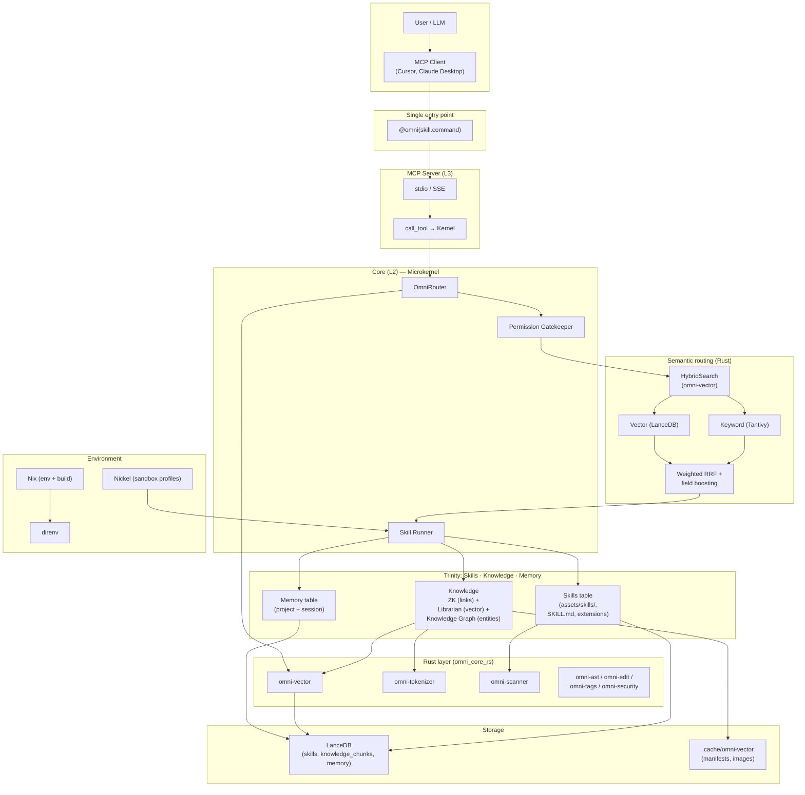
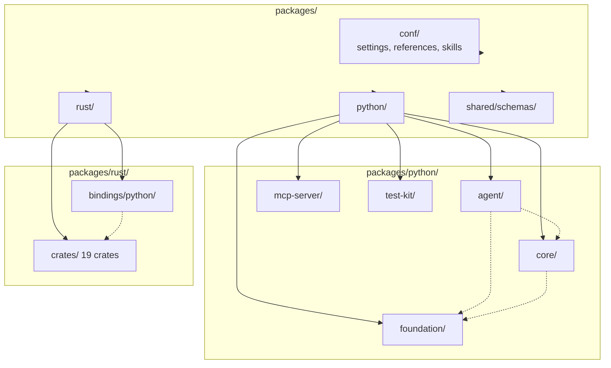
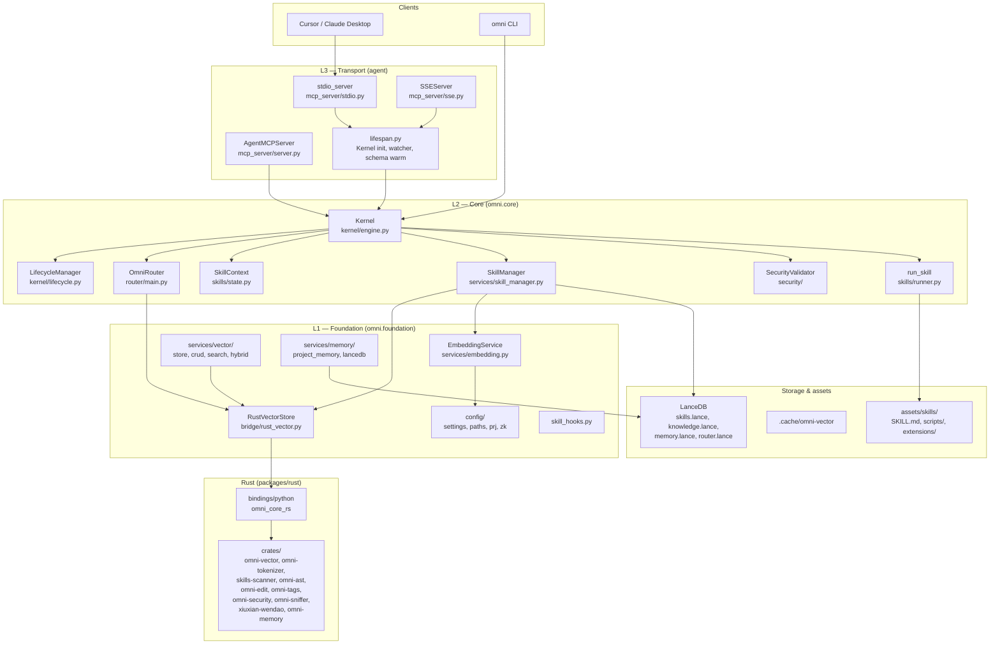
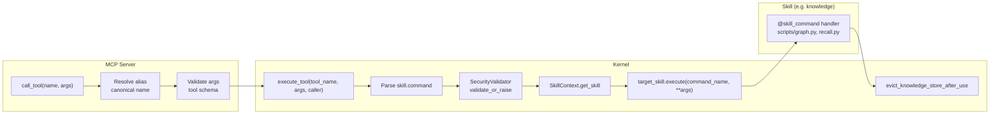
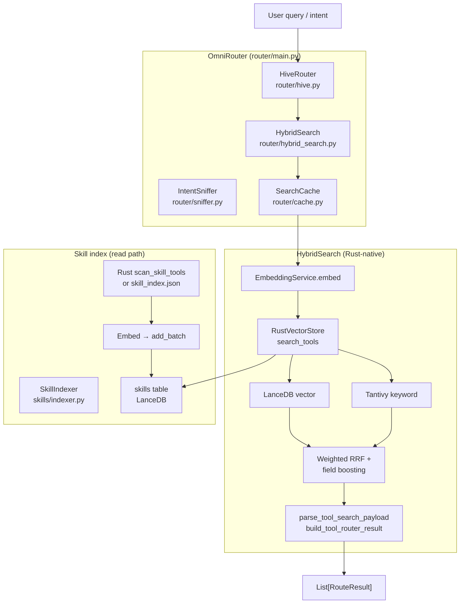
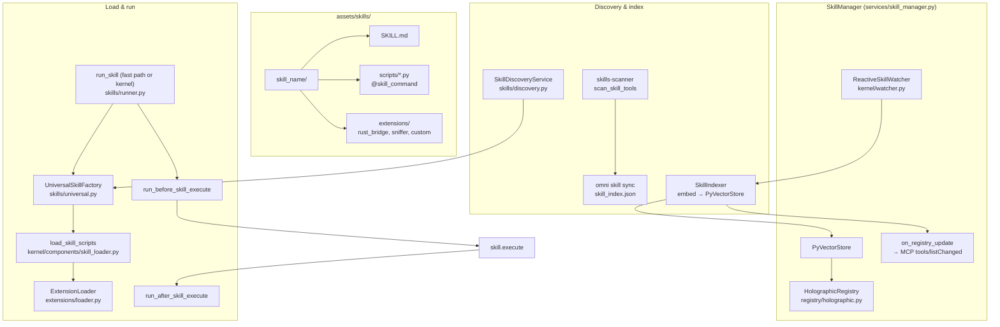
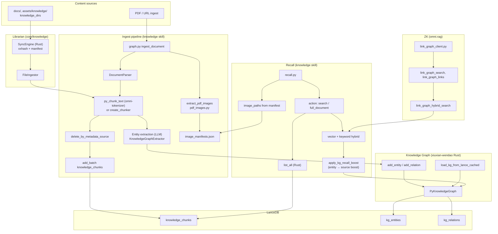
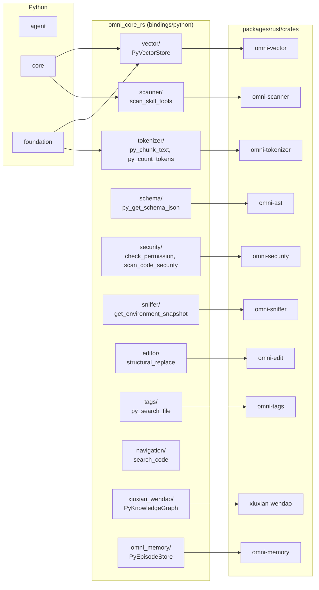
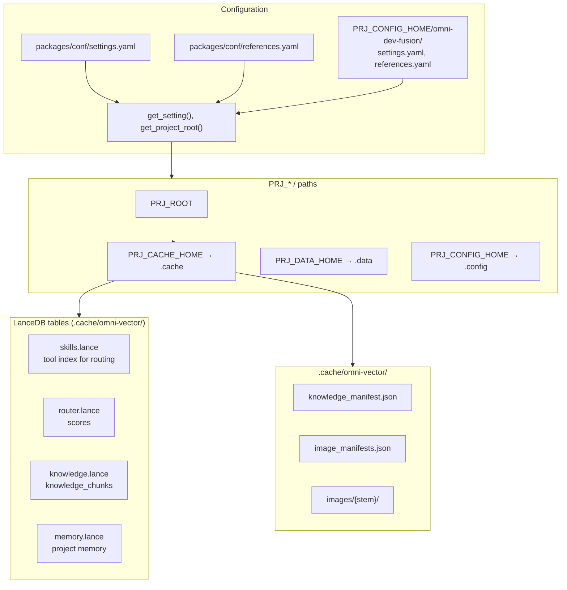

# Omni-Dev Fusion

**One entry point. Your project’s rules. Semantic routing. MCP-native.**

Omni-Dev Fusion is an **MCP (Model Context Protocol) agent** that turns your repo into a first-class context for AI: skills (git, knowledge, writer, crawl, …), a **dual knowledge index** (structure + semantics), and **project memory**—all behind a single call pattern and intent-aware routing. It also implements a **MemRL-inspired self-evolution** framework so the agent can improve at runtime without changing model weights.

## Architecture overview

The project uses a **Trinity** layering (L1 Foundation, L2 Core, L3 Transport) plus a **Rust** performance layer. Below is a concise map; the [detailed architecture](#detailed-architecture) section has full topology and data flows.



---

## Detailed architecture

The following diagrams reflect the actual code layout and data flow. Package paths are under `packages/python/` and `packages/rust/`.

**Architecture by package storage**: For a **storage-first** view (exact folders and files under `packages/`), see [docs/architecture/packages-storage.md](docs/architecture/packages-storage.md). It includes the full directory tree, Python/Rust source layout, and which package owns each concern.

### 0. Package topology (packages/ layout)



### 1. Layer topology (Trinity + Rust)



### 2. Request flow: MCP call_tool → execute_tool



### 3. Router pipeline (intent → skill.command)



### 4. Skill system (discovery, registry, execution)



### 5. Knowledge path (Librarian, ZK, knowledge graph, recall)



### 6. Rust crates and PyO3 bridge



### 7. Config and storage layout



---

## Why Omni-Dev Fusion?

Most AI coding assistants are **session-amnesic** and **tool-agnostic**: they don’t know your conventions, they can’t enforce safety, and you have to spell out which “tool” to use. Omni is built so the **project** is the source of truth and the **agent** stays on protocol.

| What you get                   | What it means for you                                                                                                                                                                                                  |
| ------------------------------ | ---------------------------------------------------------------------------------------------------------------------------------------------------------------------------------------------------------------------- |
| **One way to call everything** | `@omni("skill.command")` — same pattern for git, knowledge, writer, crawl, discovery. No separate tool namespaces or ad-hoc APIs.                                                                                      |
| **Intent-based routing**       | Say “help me commit” or “find docs about auth” in plain language. The router picks the right skill and command using **semantic + keyword** hybrid search, not just keyword match.                                     |
| **Project-aware knowledge**    | Your docs, specs, and ingested content are indexed once. Recall uses **vector + keyword** and optional **ZK link reasoning** so the agent answers from your project, not generic web knowledge.                        |
| **Safety by design**           | Skills declare permissions; a **Permission Gatekeeper** blocks unauthorized tool use. Destructive or out-of-scope actions are rejected and the agent is **re-anchored** with the skill’s protocol so it self-corrects. |
| **Consistency**                | Writing style, commit format, and conventions live in the repo (templates, SKILL.md, references). Every skill run uses them—no “this session vs that session” drift.                                                   |

---

## How we’re different

| Aspect                  | Typical AI assistant                    | Omni-Dev Fusion                                                                                                                                                                                                                                                    |
| ----------------------- | --------------------------------------- | ------------------------------------------------------------------------------------------------------------------------------------------------------------------------------------------------------------------------------------------------------------------ |
| **Context**             | Forgets your project between sessions   | **Knowledge Matrix**: skills table (tools), knowledge table (docs/specs + **knowledge graph** entities/relations), memory table (decisions/session). All queryable and used by the agent.                                                                          |
| **Safety**              | Can suggest or run destructive commands | **Zero-trust**: only skills and commands allowed by the calling skill’s `permissions` run. No raw shell escape without explicit permission.                                                                                                                        |
| **Discovery**           | You must know the exact tool name       | **Semantic routing**: natural language → weighted RRF + field boosting → best-matching skill and command. Test with `omni route test "your intent"`.                                                                                                               |
| **Learning**            | No long-term project memory             | **Project memory** (ADR-style decisions/tasks) and **session memory**; skills can remember and recall.                                                                                                                                                             |
| **Extensibility**       | Add code and wire new tools by hand     | **Skills management**: add a folder, `SKILL.md`, scripts, and optional **extensions** (Rust bridge + per-skill plugins). Run powerful scripts with injected extensions. **Hot reload**.                                                                            |
| **Environment**         | Implicit; “pip install” and hope        | **Nix + Nickel**: Nix = reproducible env and build (and skill runtimes when needed); Nickel = sandbox profiles (limits, network, syscalls). **Safe + efficient**: one declarative env, typed sandbox policy, no drift. See [Why Nix](docs/explanation/why-nix.md). |
| **Complex config**      | Hand-written YAML/JSON; easy to break   | **Nickel**: typed config; contracts at export. **LLM-oriented docs** so the model can generate correct sandbox/configs. Works with Nix for the full environment story.                                                                                             |
| **Backend**             | Python-only; slow hot paths             | **Rust ecosystem**: 19 crates (omni-vector, omni-tokenizer, omni-scanner, omni-ast, omni-edit, omni-tags, omni-security, xiuxian-wendao, omni-memory, …). Router and hybrid search 100% Rust; one PyO3 bridge (`omni_core_rs`).                                    |
| **Learning at runtime** | No self-improvement                     | **MemRL-inspired self-evolution**: episodic memory + Q-learning + two-phase retrieval; skill crystallizer turns successful runs into reusable skills. See [Self-Evolution](#self-evolution-memrl-inspired) below.                                                  |

---

## Self-Evolution (MemRL-Inspired)

The project implements a **self-evolution framework** grounded in the [MemRL paper](https://arxiv.org/abs/2601.03192) (_Self-Evolving Agents via Runtime Reinforcement Learning on Episodic Memory_, arXiv:2601.03192). The idea: the agent improves at runtime **without changing model weights** by treating memory as the plastic part and keeping reasoning (LLM + skills + router) stable.

| Principle                            | Implementation                                                                                                                                              |
| ------------------------------------ | ----------------------------------------------------------------------------------------------------------------------------------------------------------- |
| **Stable reasoning, plastic memory** | LLM and skill routing are fixed at deploy; only **episodic memory** and learned skills evolve.                                                              |
| **Two-phase retrieval**              | Phase 1: semantic recall (vector similarity). Phase 2: **Q-value reranking** so high-utility past episodes are preferred.                                   |
| **Q-learning on episodes**           | Reward signals (e.g. task success/failure) update Q-values; formula `Q_new = Q_old + α(reward - Q_old)` as in MemRL.                                        |
| **Skill crystallization**            | Successful execution traces are harvested and turned into **reusable skills** (Skill Crystallizer), so the agent moves from generalist to expert over time. |

**Rust layer (omni-memory)**  
The [omni-memory](docs/reference/omni-memory.md) crate provides the core engine: episode store, Q-table updates, two-phase search, intent encoding, and optional memory decay. Exposed to Python via `omni_core_rs` (e.g. `create_episode_store`, `create_two_phase_search`).

**Agent layer (Omega Architecture)**  
The [Omega Architecture](docs/human/architecture/omega-architecture.md) defines the **Evolution** system (`omni.agent.core.evolution`): **Harvester** (trace collection, pattern detection), **Skill Crystallizer** (trace → candidate skill → immune check → registration), and **Immune System** (Rust-backed security scan and sandbox so new skills are safe before use). Together with **Cortex** (planning), **Hippocampus** (long-term memory), and **Homeostasis** (isolation), the agent can plan, remember, and learn from experience.

**Docs to go deeper**

- [Unified Execution Engine (MemRL integration)](docs/reference/unified-execution-engine-design.md) — LangGraph + Omega, workflows, evolve loop.
- [Omni-Memory](docs/reference/omni-memory.md) — Rust implementation, MemRL claims vs implementation.
- [MemRL vs Omni-Dev-Fusion](docs/workflows/research-memrl-vs-omni-memory.md) — Research comparison and adoption notes.
- [Skill Crystallizer](docs/human/architecture/skill-crystallizer.md) — How execution traces become new skills.

---

## Trinity: Skills, Knowledge, Memory

Three pillars that work together.

### 1. Skills — a management platform

We’re building a **skills management system**, not just a fixed set of tools. The **skills directory** (`assets/skills/`) is the hub: discover skills, run **extensions**, and execute **scripts** that get injected capabilities.

- **Run from the skills dir**: Each skill is a self-contained package (metadata in `SKILL.md`, commands as `@skill_command` functions, optional Jinja2 templates and reference docs). The runtime discovers and loads them; you can add or customize skills without touching the core.
- **Extensions**: Optional plugins live in each skill’s `extensions/` directory—discovery over configuration, no central registry. **Built-in**: `rust_bridge` (high-performance Rust bindings) is auto-injected into scripts. **Per-skill**: add custom extensions (e.g. analytics, hooks); scripts receive them and can use Rust when available with a Python fallback (graceful degradation).
- **Powerful scripts**: Skill commands are implemented as scripts that run in a consistent context: they see the same extensions, templates, and permissions. So you get both “simple” zero-code skills (folder + SKILL.md + decorator) and “heavy” skills that combine scripts and extensions.

The skills you see today (git, knowledge, writer, crawl4ai, memory, skill, advanced_tools, researcher, documentation, …) are the **first wave**; the architecture is built for many more and for your own skills.

- **Git**: status, commit, branch, **smart_commit** (human-in-the-loop).
- **Knowledge**: recall, ingest, LinkGraph search, link_graph_hybrid_search.
- **Writer**, **Crawl4ai**, **Memory**, **Skill** (discover, list, reload), **Advanced tools**, **Researcher**, **Documentation**, **python_engineering**, **rust_engineering** — same pattern, same management layer.

### 2. Knowledge — LinkGraph, vector, and knowledge graph

We don’t treat “knowledge” as one big blob. There are **three complementary layers**:

| Layer                        | Role                                                                                                           | When to use                                                                                                                   |
| ---------------------------- | -------------------------------------------------------------------------------------------------------------- | ----------------------------------------------------------------------------------------------------------------------------- |
| **LinkGraph (Zettelkasten)** | All project markdown; **link graph** and structure.                                                            | “Which notes link to this?” “Navigate by structure.” `knowledge.link_graph_search`, `knowledge.link_graph_links`.             |
| **Librarian (vector)**       | Chunked and embedded **subset** of content (`knowledge_dirs`).                                                 | “Find by meaning.” Semantic + keyword hybrid. `knowledge.recall`, and the vector leg of `knowledge.link_graph_hybrid_search`. |
| **Knowledge Graph**          | **Entities and relations** extracted at ingest (LLM), stored in Rust (`xiuxian-wendao`), persisted in LanceDB. | “Who uses what?” “What’s related?” Recall boost and entity rerank in **dual-core fusion** (LinkGraph + vector + KG).          |

**Knowledge graph pipeline**  
During ingest (`knowledge.ingest_document` with `extract_entities` / `store_in_graph`), the pipeline can run **entity extraction** (LLM) on each chunk and write **entities** (PERSON, ORGANIZATION, CONCEPT, PROJECT, TOOL, …) and **relations** (WORKS_FOR, USES, DEPENDS_ON, DOCUMENTED_IN, …) into the **Rust knowledge graph** (`PyKnowledgeGraph`). Data lives in LanceDB (`kg_entities`, `kg_relations`); a **KG cache** (`load_kg_from_lance_cached`) avoids reloading on every recall. In **recall**, the dual-core layer can **boost** chunks whose sources are connected to query entities in the graph (`apply_kg_recall_boost`), so retrieval combines semantic similarity, LinkGraph proximity, and graph-backed entity relevance. See [Dual-Core Knowledge Architecture](docs/architecture/link-graph-knowledge-enhancement.md) and [Knowledge Matrix](docs/human/architecture/knowledge-matrix.md).

- **Incremental ingestion**: only changed files are re-chunked and re-embedded (hash-based manifest).
- **Chunk modes**: AUTO (detect doc vs code), TEXT (docs), AST (code) so the right granularity is indexed.
- Ingest from **local docs**, **URLs** (crawl), or **PDFs**; then query in natural language.

### 3. Memory — project and session

- **Project memory**: ADR-style decisions and tasks, stored in LanceDB. The agent can record and recall “what we decided” and “what’s in progress.”
- **Session and episodic memory**: context and notes so the agent doesn’t start from zero every time.

---

## Semantic routing that actually works

Routing isn’t “keyword match + hope.” It’s a **hybrid retrieval pipeline** tuned for “which skill and command should handle this intent?”

- **Weighted RRF + field boosting**: Vector and keyword streams are fused with **weighted reciprocal rank fusion** (low k for precision). **Field boosting** adds hard signals (e.g. token match on skill/command name) so the right tool wins instead of scores flattening.
- **Agentic search**: For tool routing, the system can choose **exact** (keyword-only), **semantic**, or **hybrid** per query. You get the right strategy without configuring it yourself.
- **Transparency**: `omni route test "intent"` shows which skill and command would run. With `--json --explain` you see per-result scores (vector, keyword, final) so you can tune or debug.

This is the same stack we use for **knowledge recall** (vector + keyword over the Librarian index) and **tool search** (skills table). One retrieval story across skills and knowledge.

---

## Safety and cognitive control

- **Permission Gatekeeper**: Every tool execution is checked against the **calling skill’s** declared `permissions`. Cross-skill or raw shell use is blocked unless explicitly allowed.
- **Re-anchoring**: If the agent drifts (e.g. tries a generic shell instead of the skill’s tool), the Gatekeeper **injects the skill’s SKILL.md** into the error. The LLM is forced back onto the skill’s protocol.
- **Cognitive load**: When too many skills are active, the system can warn so you trim context and keep behavior precise.

---

## Rust implementation and ecosystem

The heavy lifting is done in **Rust**: 15+ crates under `packages/rust/crates/`, with a single **PyO3 bridge** (`omni_core_rs`) so Python orchestrates and Rust executes. This isn’t “a few helpers”—it’s the core of routing, search, ingestion, and safety.

### Core crates and what they do

| Crate              | Purpose                                                                                                                                                        | Why it matters                                                                                                                                                                                                        |
| ------------------ | -------------------------------------------------------------------------------------------------------------------------------------------------------------- | --------------------------------------------------------------------------------------------------------------------------------------------------------------------------------------------------------------------- |
| **omni-vector**    | LanceDB-backed vector store, hybrid search (vector + keyword), skill/tool index, FTS (Tantivy), maintenance, observability                                     | **Router is 100% Rust-native**: tool search, weighted RRF, and field boosting run here. Knowledge chunks and project memory use the same store. Query–release lifecycle keeps the MCP process lean (evict after use). |
| **omni-tokenizer** | tiktoken-rs (cl100k_base), token counting, truncation, **chunk_text** (token-aware chunking for ingest), **ContextPruner** (message compression for LangGraph) | **20–100× faster** than Python tiktoken. Ingest uses Rust chunking by default; context pruning keeps conversation windows bounded.                                                                                    |
| **skills-scanner** | Scan `assets/skills/`: parse SKILL.md, discover @skill_command scripts, build ToolRecord and reference paths                                                   | **Single source of truth** for the skill index. `omni skill sync` generates `skill_index.json`; no Python file scanning.                                                                                              |
| **omni-ast**       | AST utilities (ast-grep), **SecurityScanner** (forbidden imports, eval/exec, dangerous patterns)                                                               | **First-line safety**: scan code before execution; violations (e.g. `import os`, `eval()`) are reported with rule IDs and snippets.                                                                                   |
| **omni-edit**      | Structural search & replace (pattern/rewrite), single-file and **batch refactor** with rayon, diff preview                                                     | **The Surgeon**: refactor by AST, not regex. Python bindings: `structural_replace`, `structural_preview`, `batch_structural_replace`.                                                                                 |
| **omni-tags**      | Symbol extraction (classes, functions, traits), file outline, code search (pattern-based)                                                                      | **The Cartographer**: outline and search across codebases; powers navigation and code-aware tools.                                                                                                                    |
| **omni-security**  | Secret scanning (AWS keys, Stripe, Slack, PEM, API keys) with DFA regex, O(n)                                                                                  | High-throughput secret detection in content and blobs.                                                                                                                                                                |
| **omni-sniffer**   | Environment snapshot: Git branch, modified/staged count, dirty files, scratchpad context                                                                       | **Sensory input** for the agent: what’s the repo state without running git in Python.                                                                                                                                 |
| **xiuxian-wendao** | Knowledge graph storage, KG cache, types and operations for graph-backed RAG                                                                                   | Graph layer for entities and relations; used alongside vector recall.                                                                                                                                                 |
| **omni-types**     | Common types (Skill, SkillDefinition, TaskBrief, VectorSearchResult, EnvironmentSnapshot, …) + **Schema Singularity**                                          | **SSOT for schemas**: Rust exports JSON Schema for each type; Python and LLMs call `py_get_schema_json("SkillDefinition")` for authoritative shapes.                                                                  |

### Python ↔ Rust

- **One bridge**: `omni_core_rs` (PyO3) exposes vector store, tokenizer, security scan, structural edit, schema registry, sniffer, scanner, and more. Skills and the MCP server use it; no duplicate logic in Python for hot paths.
- **Workflow**: Rust tests first (`cargo test -p omni-vector` etc.), then Python integration and `uv sync --reinstall-package omni-core-rs` when the bridge changes. See [Project Execution Standard](docs/reference/project-execution-standard.md).

### Why it matters for you

- **Speed**: Routing and hybrid search are Rust-native; tokenization and chunking are orders of magnitude faster; batch refactors and scans are parallel (rayon).
- **Safety**: Secret scanning and AST-based security checks run before code execution; the agent can’t silently bypass them.
- **Consistency**: Skill index and tool search come from one scanner and one vector store; Schema Singularity means one definition of “Skill” or “ToolRecord” for the whole stack.

For the full crate list, APIs, and bindings, see [Rust crates](docs/architecture/rust-crates.md).

---

## Nix + Nickel: safe, efficient environments

**Reproducible environments and sandboxed execution in one stack.** We use **Nix** for the whole environment and **Nickel** for sandbox profiles; together they give you a **safe and efficient** setup that’s hard to get elsewhere.

| Layer      | What it does                                                                                                                                   | Why it matters                                                                                                                                                                        |
| ---------- | ---------------------------------------------------------------------------------------------------------------------------------------------- | ------------------------------------------------------------------------------------------------------------------------------------------------------------------------------------- |
| **Nix**    | Manages **environment and build**: dev shell (Rust, Python, uv, system deps), and the exact runtime when skills need complex or isolated envs. | One declaration in the repo; `direnv allow` and everyone has the same toolchain. Skills that need a specific Python version or locked deps run **inside Nix**—reproducible, no drift. |
| **Nickel** | Generates **sandbox profiles**: resource limits, network policy, syscalls, mounts. Typed config; contracts validate at export; Rust executes.  | You define _what_ is allowed (policy); the runtime enforces _how_. No hand-written YAML; LLM-friendly docs so the model can generate correct sandbox configs.                         |

**Safety**: Sandbox profiles restrict what a process can do (memory, CPU, network, syscalls). **Efficiency**: Nix supplies exactly the environment needed—no “pip install and hope,” no leftover state. So: **Nix = overall environment**, **Nickel = per-run sandbox policy**. Together they’re the environment and isolation story for both daily dev and skill execution.

- **Dev**: Nix + **direnv** — `direnv allow` at repo root; hermetic shell, same stack on macOS, Linux, and CI.
- **Skills**: When a skill needs a complex or locked environment, it runs in a Nix-provided env; when it needs isolation, Nickel-defined profiles + Rust execution sandbox it.

See [Why Nix](docs/explanation/why-nix.md) and [Getting Started](docs/tutorials/getting-started.md) (Step 1: `direnv allow`). For Nickel vs Rust: [Nickel–Rust responsibilities](docs/reference/nickel-rust-responsibilities.md).

---

## GitOps + version control

Config, conventions, and tooling live in the repo and are **version-controlled**:

- **Skill index** (e.g. `skill_index.json`), **schemas**, and **contracts** are committed; CI validates them.
- **GitOps-style workflows**: e.g. smart*commit (human-in-the-loop, no destructive git), verification helpers, and repo as source of truth for paths and settings (`PRJ*\*`, `get_project_root()`). Changes are auditable and reproducible.

---

## Nickel: typed config for humans and LLMs

**Nickel** is the **sandbox and policy layer** in the [Nix + Nickel](#nix--nickel-safe-efficient-environments) story: statically-typed config for sandbox profiles (nsjail, seatbelt), security policies, and workflow definitions. Types and **contracts** catch errors at export time; you export to JSON/YAML and the runtime (Rust) executes.

- **Clear split**: Nickel = _what_ (policy, types, constraints); Rust = _how_ (execution, isolation, monitoring). See [Nickel–Rust responsibilities](docs/reference/nickel-rust-responsibilities.md).
- **LLM-friendly**: Handbooks and interface-style docs so **the model can generate correct, complex configs** instead of brittle YAML/JSON. Typed configs reduce hallucination and invalid output.

Nickel configs live in `packages/ncl/` (sandbox, seatbelt, nsjail modules). Use them for sandboxed skill execution and for generating configs from natural language.

---

## What you can do today

| Goal                            | How                                                                                                                                                                           |
| ------------------------------- | ----------------------------------------------------------------------------------------------------------------------------------------------------------------------------- |
| Commit with project conventions | `@omni("git.smart_commit")` or `omni run git commit` — no destructive git, human-in-loop.                                                                                     |
| Search the codebase by intent   | `omni route test "refactor auth module"` → see which skill/command would run; then run it via MCP or `omni run`.                                                              |
| Query project knowledge         | Ingest with `omni sync knowledge` (and optional crawl/PDF ingest). Then `knowledge.recall "How does our auth work?"` or `link_graph_hybrid_search` for structure + semantics. |
| Polish docs to your style       | Writer skill + your style guides; polish and structure checks.                                                                                                                |
| Crawl and ingest the web        | Crawl4ai skill: point at a URL, crawl and ingest into the knowledge base.                                                                                                     |
| Remember decisions              | Memory skill: save and recall project decisions and context.                                                                                                                  |

---

## Quick start

**Prerequisites:** Nix (recommended) or Python 3.11+, [uv](https://docs.astral.sh/uv/).

```bash
git clone https://github.com/tao3k/omni-dev-fusion.git && cd omni-dev-fusion

# With Nix + direnv (recommended)
direnv allow
uv sync --all-extras

# Or without Nix
uv sync --all-extras
```

**Run the MCP server** (for Claude Desktop, Cursor, or other MCP clients):

```bash
omni mcp                              # Stdio (e.g. Claude Desktop)
omni mcp --transport sse --port 3002  # SSE (e.g. Claude Code)
```

**Try routing and a skill:**

```bash
omni route test "help me commit my changes"
omni route test "search the codebase for auth logic"
omni run knowledge recall "How does our auth work?"
```

---

## Where to go next

| You want to…                                            | Go here                                                                                                                                                                                          |
| ------------------------------------------------------- | ------------------------------------------------------------------------------------------------------------------------------------------------------------------------------------------------ |
| Set up step-by-step                                     | [Getting Started](docs/tutorials/getting-started.md)                                                                                                                                             |
| See all skills and commands                             | [Skills directory](assets/skills/README.md)                                                                                                                                                      |
| Add extensions or run scripts                           | [Extension system](docs/reference/extension-system.md)                                                                                                                                           |
| Understand scenarios and value                          | [Why Omni-Dev Fusion](docs/explanation/why-omni-dev-fusion.md)                                                                                                                                   |
| Nix and hermetic env                                    | [Why Nix](docs/explanation/why-nix.md)                                                                                                                                                           |
| Nickel and typed config                                 | [Nickel–Rust responsibilities](docs/reference/nickel-rust-responsibilities.md), `packages/ncl/`                                                                                                  |
| Rust crates and bindings                                | [Rust crates](docs/architecture/rust-crates.md)                                                                                                                                                  |
| Self-evolution (MemRL) and Omega                        | [Omni-Memory](docs/reference/omni-memory.md), [Omega Architecture](docs/human/architecture/omega-architecture.md), [Unified Execution Engine](docs/reference/unified-execution-engine-design.md) |
| Knowledge graph and dual-core (LinkGraph + vector + KG) | [Dual-Core Knowledge Architecture](docs/architecture/link-graph-knowledge-enhancement.md), [Knowledge Matrix](docs/human/architecture/knowledge-matrix.md)                                       |
| Browse all docs                                         | [Documentation index](docs/index.md)                                                                                                                                                             |

---

## License

See [LICENSE](LICENSE) in this repository.
