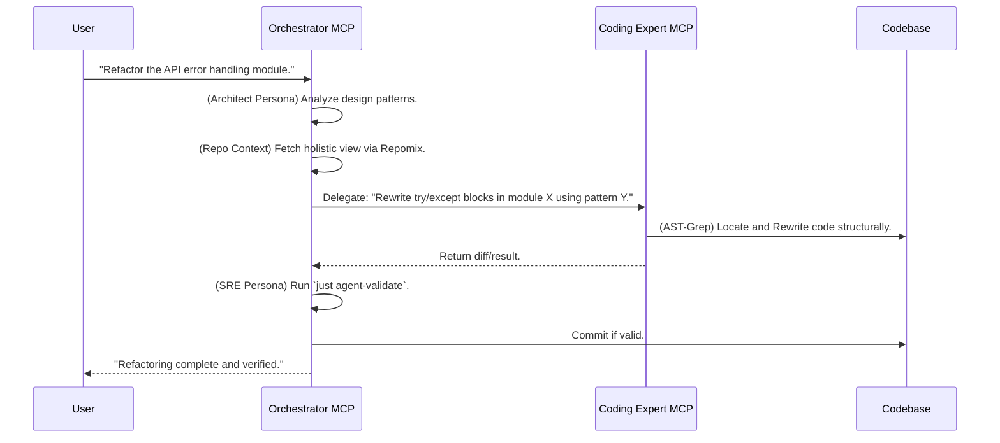

# Design & Roadmap: Dual-MCP Server Architecture

> **Philosophy**: Separation of Concerns. "Macro" orchestration vs. "Micro" surgical coding.

This document outlines the architectural vision for `omni-devenv-fusion`. We move from a single monolithic MCP server to a specialized dual-server setup. This design acts as a **Bridge** between generic LLM capabilities and the strict requirements of our Nix-based project environment.

---

## The Problem We Solve

Generic AI doesn't understand your project's context. It writes code that doesn't match your stack.

```bash
# You ask the AI
> Deploy to K8s

# AI creates this (wrong stack!)
> helm install myapp ./chart
# But your project uses Kustomize + Nix!
```

The Bridge Pattern solves this by routing through personas that understand your project's conventions.

---

## Architectural Overview

The system divides into two distinct MCP servers, each serving a specific abstraction level.

| Server | Focus | Role |
|--------|-------|------|
| **Orchestrator** | SDLC, DevOps, SRE, Architecture | High-level decision making, context gathering |
| **Coder** | Code implementation, AST refactoring | Precise execution, surgical precision |

### Server A: The Orchestrator (The "Brain")

* **Focus**: SDLC, DevOps, MLOps, SRE, Architecture, Policy Enforcement.
* **View**: "Macro." Uses `Repomix` to see the forest, not the trees.

**Core Responsibilities:**

| Responsibility | Description |
|----------------|-------------|
| **SDLC Guardrails** | Enforce "Plan -> Consult -> Implement -> Validate" loop |
| **Context Aggregation** | Fetch holistic project views via `get_codebase_context` |
| **Specialist Delegation** | Route queries to personas (Architect, Platform, DevOps, SRE) |
| **Execution Management** | Safely trigger `just` commands to verify changes |

**The Bridge Role:**

| Capability | Implementation |
|------------|----------------|
| **Contextual Adaptation** | Translate "Deploy to K8s" → "Configure devenv.nix + helm modules" |
| **Policy Enforcement** | Reject commits that violate `CLAUDE.md` rules |

### Server B: The Coder (The "Hands")

* **Focus**: High-quality code, AST-based refactoring, Performance, Security.
* **View**: "Micro." Uses `ast-grep` for surgical precision.

**Core Responsibilities:**

| Responsibility | Description |
|----------------|-------------|
| **Surgical Refactoring** | Structural code changes, not line-based text replacement |
| **Quality Assurance** | Apply linters (`ruff`, `nixfmt`) before returning code |
| **Security Scanning** | Detect hardcoded secrets or unsafe patterns |

**The Bridge Role:**

| Capability | Implementation |
|------------|----------------|
| **Syntax Adaptation** | Match code to `treefmt.toml` or `.editorconfig` |
| **Performance Optimization** | Optimize patterns (e.g., Python `uv` dependency management) |

---

## Interaction Workflow

The Orchestrator plans, the Coder executes, and both validate.



### Few-Shot Example: Refactoring Workflow

**Input (User → Orchestrator):**

```
> Refactor all try/except blocks in mcp-server/orchestrator.py to use structured error handling
```

**Orchestrator → Architect Persona:**

```
> Review the current error handling patterns in the codebase. What ADR defines our error handling strategy?
```

**Architect → Orchestrator:**

```
> See ADR-007: Structured Error Handling. Use the `Result[T, E]` pattern from the `result` crate.
```

**Orchestrator → Coder:**

```
> Task: refactor
> Pattern: try_stmt
> Language: python
> Details: Rewrite all try/except blocks to use Result[T, E] pattern
```

**Coder → Repo:**

```bash
# ast-grep finds and rewrites the code
ast-grep run -p 'try: $body except $handler: $recovery' -l py --update-all
```

**Coder → Orchestrator:**

```
> Refactored 12 try/except blocks.
> Files modified: mcp-server/orchestrator.py
```

**Orchestrator → SRE Persona:**

```
> Validate the changes. Run `just validate` and report results.
```

**SRE → Orchestrator:**

```
> All checks pass. Ready to commit.
```

---

## Toolset Roadmap

### Orchestrator Tools

| Tool | Status | Purpose |
|------|--------|---------|
| `consult_specialist` | Existing | Multi-persona routing |
| `get_codebase_context` | Existing | Holistic project view (Repomix) |
| `run_task` | Existing | Safe execution of `just` commands |
| `read_backlog` | Future | Integration with task tracking |

### Coder Tools

| Tool | Status | Purpose |
|------|--------|---------|
| `ast_search` | Existing | Query code structure using `ast-grep` patterns |
| `ast_rewrite` | Existing | Apply structural patches via AST |
| `read_file` | Existing | Lightweight single-file reading |
| `search_files` | Existing | Pattern search (grep-like) |
| `save_file` | Existing | Write with backup and syntax validation |

---

## Why Dual-MCP?

| Challenge | Single Server | Dual-MCP Solution |
|-----------|---------------|-------------------|
| **Context overload** | One server handles all tools | Orchestrator aggregates; Coder executes surgically |
| **Role confusion** | Same tools for planning and coding | Specialized personas for each domain |
| **Latency** | N+1 tool calls for complex tasks | Parallel context fetching via Repomix |
| **Quality** | Generic code generation | AST-based refactoring ensures syntactic correctness |

---

## Next Steps

1. **Phase 4**: Complete the "closed-loop" execution (Orchestrator → Coder → Validate → Commit)
2. **Phase 5**: Add memory persistence (`.memory/` ADRs)
3. **Phase 6**: Integrate community MCPs (Kubernetes, PostgreSQL) via community proxy

See [`why-custom-mcp-architecture.md`](./why-custom-mcp-architecture.md) for the rationale behind this design.
