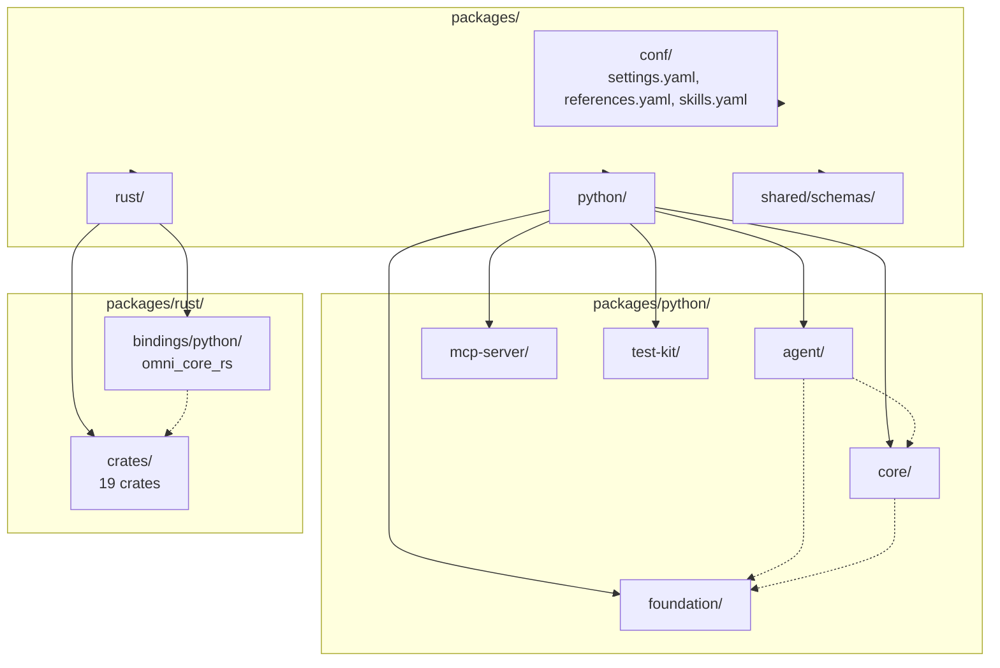
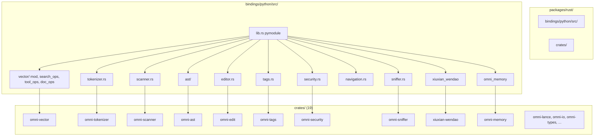

# Architecture by Package Storage

This document describes the project architecture as it is **stored under `packages/`**. All paths are relative to the repository root. The layout is the single source of truth for where code lives.

---

## 1. Root layout under `packages/`

```
packages/
├── conf/                    # System configuration (SSOT)
│   ├── settings.yaml
│   ├── references.yaml
│   └── skills.yaml
│
├── python/                  # Python workspace (Trinity + agent + test-kit)
│   ├── agent/               # CLI + MCP server + workflows (depends on core, foundation)
│   ├── core/                # Microkernel: kernel, router, skills, knowledge (L2)
│   ├── foundation/          # Config, bridge, services, RAG (L1)
│   ├── mcp-server/          # MCP transport types + stdio/SSE (L3; used by agent)
│   └── test-kit/            # Pytest fixtures, benchmarks, plugins
│
├── rust/
│   ├── bindings/
│   │   └── python/          # PyO3 crate omni_core_rs (exposes crates to Python)
│   │       └── src/         # lib.rs + vector/, ast/, scanner.rs, etc.
│   └── crates/              # 19 Rust crates
│       ├── omni-ast/
│       ├── omni-edit/
│       ├── omni-events/
│       ├── omni-executor/
│       ├── omni-io/
│       ├── xiuxian-wendao/
│       ├── omni-lance/
│       ├── omni-macros/
│       ├── omni-memory/
│       ├── omni-sandbox/
│       ├── omni-scanner/
│       ├── omni-security/
│       ├── omni-sniffer/
│       ├── omni-tags/
│       ├── omni-tokenizer/
│       ├── omni-tui/
│       ├── omni-types/
│       └── omni-vector/
│
└── shared/                  # Shared schemas (e.g. router config)
    └── schemas/
```

---

## 2. Diagram: Package topology (storage-based)



---

## 3. Python packages: source layout

Each Python package follows `packages/python/<pkg>/src/omni/...`. The import namespace is `omni.<pkg>` or `omni.agent`, `omni.core`, `omni.foundation`, `omni.mcp`, `omni.test_kit`.

### 3.1 packages/python/agent (omni.agent)

**Role**: CLI entry point, MCP server lifecycle, tool execution, workflows.

| Path under `agent/src/omni/agent/`            | Purpose                                                                    |
| --------------------------------------------- | -------------------------------------------------------------------------- |
| `cli/app.py`                                  | CLI app (Typer)                                                            |
| `cli/runner.py`                               | Skill run orchestration                                                    |
| `cli/commands/*.py`                           | Commands: route, mcp, run, sync, knowledge, skill/_, db/_, memory, reindex |
| `mcp_server/server.py`                        | MCP server: list_tools, call_tool                                          |
| `mcp_server/lifespan.py`                      | Startup: Kernel init, tool list, schema warm                               |
| `mcp_server/stdio.py`, `sse.py`               | Transports                                                                 |
| `run_tool.py`                                 | Bridge call_tool → Kernel.execute_tool                                     |
| `services/sync.py`, `reindex.py`, `memory.py` | Agent services                                                             |
| `workflows/run_entry.py`                      | Run workflow entry                                                         |
| `workflows/memory/`, `robust_task/`           | LangGraph-style workflows                                                  |
| `core/`                                       | Cortex, context, evolution, memory, omni (graph/state)                     |
| `langgraph/`                                  | Checkpoint, nodes, orchestrator, skills                                    |

### 3.2 packages/python/core (omni.core)

**Role**: Microkernel (L2): engine, router, skills, knowledge.

| Path under `core/src/omni/core/`    | Purpose                                                               |
| ----------------------------------- | --------------------------------------------------------------------- |
| `kernel/engine.py`                  | Kernel: execute_tool, lifecycle, skill_context, router, skill_manager |
| `kernel/lifecycle.py`               | LifecycleManager, states                                              |
| `kernel/watcher.py`                 | ReactiveSkillWatcher, file watcher                                    |
| `kernel/components/skill_loader.py` | Load skill scripts                                                    |
| `kernel/components/mcp_tool.py`     | MCP tool list from kernel                                             |
| `router/main.py`                    | OmniRouter                                                            |
| `router/hybrid_search.py`           | HybridSearch (RustVectorStore)                                        |
| `router/hive.py`                    | HiveRouter                                                            |
| `router/indexer.py`                 | Skill index (semantic)                                                |
| `router/sniffer.py`                 | IntentSniffer                                                         |
| `router/router.py`                  | SemanticRouter, UnifiedRouter                                         |
| `skills/discovery.py`               | SkillDiscoveryService (Rust scan)                                     |
| `skills/indexer.py`                 | SkillIndexer (embed → vector store)                                   |
| `skills/registry/holographic.py`    | HolographicRegistry (LanceDB-backed)                                  |
| `skills/runner.py`                  | run_skill (fast path / kernel)                                        |
| `skills/universal.py`               | UniversalScriptSkill, UniversalSkillFactory                           |
| `skills/extensions/`                | rust_bridge, sniffer, loader                                          |
| `services/skill_manager.py`         | SkillManager (store, HolographicRegistry, Watcher)                    |
| `knowledge/librarian.py`            | Librarian, SyncEngine, ingestion                                      |
| `security/`                         | SecurityValidator (Rust check_permission)                             |

### 3.3 packages/python/foundation (omni.foundation)

**Role**: Infrastructure (L1): config, paths, Rust bridge, vector/memory/LLM services, RAG.

| Path under `foundation/src/omni/foundation/`                               | Purpose                                           |
| -------------------------------------------------------------------------- | ------------------------------------------------- |
| `config/settings.py`                                                       | get_setting(), Settings                           |
| `config/prj.py`                                                            | PRJ_DATA, PRJ_CACHE, PRJ_CONFIG_HOME              |
| `config/database.py`, `paths.py`, `link_graph.py`, `link_graph_runtime.py` | DB, paths, LinkGraph config/runtime               |
| `bridge/rust_vector.py`                                                    | RustVectorStore (PyVectorStore)                   |
| `bridge/rust_scanner.py`, `tool_record_validation.py`                      | Scanner, validation                               |
| `services/embedding.py`                                                    | EmbeddingService                                  |
| `services/vector/`                                                         | store, crud, search, hybrid, knowledge            |
| `services/memory/`                                                         | project_memory, LanceDB store                     |
| `services/llm/`                                                            | client, provider, api, personas                   |
| `skill_hooks.py`                                                           | run_before_skill_execute, run_after_skill_execute |
| `runtime/gitops.py`                                                        | get_project_root()                                |
| `api/`                                                                     | decorators, mcp_schema, protocols                 |

| Path under `foundation/src/omni/rag/`       | Purpose                                               |
| ------------------------------------------- | ----------------------------------------------------- |
| `graph.py`                                  | Ingest pipeline (document, chunk, images)             |
| `link_graph_enhancer.py`, `link_graph/`     | LinkGraph backend, enhancement, common graph engine   |
| `dual_core/`                                | LinkGraph proximity, vector bridge, fusion, kg_recall |
| `retrieval/`                                | Hybrid retrieval, factory, lancedb                    |
| `document.py`, `pdf_images.py`, `config.py` | Document model, PDF images, RAG config                |

| Other under `foundation/src/omni/` | Purpose                                        |
| ---------------------------------- | ---------------------------------------------- |
| `tracer/`                          | Graphflow, pipeline, MCP invoker, skill runner |

### 3.4 packages/python/mcp-server (omni.mcp)

**Role**: MCP protocol (L3): types, server, transport. Consumed by agent which wires Kernel.

| Path under `mcp-server/src/omni/mcp/` | Purpose                 |
| ------------------------------------- | ----------------------- |
| `server.py`                           | MCPServer orchestration |
| `interfaces.py`                       | Protocol interfaces     |
| `gateway.py`                          | Gateway layer           |
| `transport/stdio.py`                  | StdioTransport          |
| `transport/sse.py`                    | SSEServer               |

### 3.5 packages/python/test-kit (omni.test_kit)

**Role**: Test utilities: fixtures (core, vector, link graph extractors, scanner, execution), benchmarks, plugin.

| Path under `test-kit/src/omni/test_kit/` | Purpose                                                          |
| ---------------------------------------- | ---------------------------------------------------------------- |
| `fixtures/`                              | core, vector, rag, link_graph, execution, skill_builder, watcher |
| `benchmark.py`                           | Benchmark helpers                                                |
| `plugin.py`                              | Pytest plugin                                                    |
| `mcp.py`, `skill.py`, `gitops.py`        | Test helpers                                                     |

---

## 4. Diagram: Python package structure (storage)

```mermaid
flowchart LR
    subgraph Agent["packages/python/agent"]
        A1["cli/ app, runner, commands"]
        A2["mcp_server/ server, lifespan, stdio, sse"]
        A3["services/ sync, reindex, memory"]
        A4["workflows/ run_entry, memory, robust_task"]
        A5["core/ cortex, context, evolution"]
        A6["langgraph/ checkpoint, nodes, orchestrator"]
    end

    subgraph Core["packages/python/core"]
        C1["kernel/ engine, lifecycle, watcher"]
        C2["router/ main, hybrid_search, hive, indexer"]
        C3["skills/ discovery, indexer, runner, universal"]
        C4["skills/registry/ holographic"]
        C5["skills/extensions/ rust_bridge, sniffer"]
        C6["knowledge/ librarian"]
        C7["services/ skill_manager"]
        C8["security/"]
    end

    subgraph Foundation["packages/python/foundation"]
        F1["config/ settings, prj, database, link_graph"]
        F2["bridge/ rust_vector, rust_scanner"]
        F3["services/ embedding, vector, memory, llm"]
        F4["rag/ graph, link_graph_*, dual_core"]
        F5["runtime/ gitops"]
        F6["skill_hooks.py"]
    end

    subgraph Mcp["packages/python/mcp-server"]
        M1["server, interfaces, gateway"]
        M2["transport/ stdio, sse"]
    end

    subgraph TestKit["packages/python/test-kit"]
        T1["fixtures/ core, vector, link_graph, execution"]
        T2["benchmark, plugin"]
    end

    Agent --> Core
    Agent --> Foundation
    Core --> Foundation
    TestKit --> Core
    TestKit --> Foundation
```



---

## 5. Rust: crates and bindings

### 5.1 packages/rust/crates (19 crates)

| Crate            | Role                                                                             |
| ---------------- | -------------------------------------------------------------------------------- |
| `omni-vector`    | LanceDB vector store, tool search, search cache, list_all                        |
| `omni-tokenizer` | py_chunk_text, py_count_tokens, tiktoken                                         |
| `omni-scanner`   | scan_skill_tools, scan_skill, scan_paths (skill discovery)                       |
| `omni-ast`       | AST (ast-grep), py_extract_items, py_chunk_code                                  |
| `omni-edit`      | structural_replace, structural_preview                                           |
| `omni-tags`      | Symbol extraction, py_search_file                                                |
| `omni-security`  | check_permission, scan_secrets, scan_code_security                               |
| `omni-sniffer`   | get_environment_snapshot                                                         |
| `xiuxian-wendao` | PyKnowledgeGraph, PySyncEngine, LinkGraph extractors, kg_cache, dependency index |
| `omni-memory`    | Episode store, Q-table, two-phase search, create_episode_store                   |
| `omni-lance`     | LanceDB RecordBatch utilities                                                    |
| `omni-io`        | read_file_safe, file I/O                                                         |
| `omni-types`     | Shared types                                                                     |
| `omni-events`    | Event topics (file_changed, agent_think, etc.)                                   |
| `omni-executor`  | PyOmniCell, build_query (Nushell)                                                |
| `omni-sandbox`   | Sandbox (NCL/Nickel)                                                             |
| `omni-macros`    | Procedural macros                                                                |
| `omni-tui`       | TUI support                                                                      |

### 5.2 packages/rust/bindings/python (omni_core_rs)

**Entry**: `src/lib.rs` — PyO3 `#[pymodule]` registering all Python-callable functions and types.

| Module / file                | Exposes (from crates)                                                     |
| ---------------------------- | ------------------------------------------------------------------------- |
| `vector/mod.rs`              | PyVectorStore, create_vector_store_py, search, add_batch, list_all        |
| `vector/search_ops.rs`       | search_tools, tool search                                                 |
| `vector/tool_ops.rs`         | Tool record ops                                                           |
| `vector/doc_ops.rs`          | Document ops                                                              |
| `tokenizer.rs`               | py_chunk_text, py_count_tokens, py_truncate                               |
| `scanner.rs`                 | scan_skill_tools, scan_skill, scan_paths, diff_skills                     |
| `schema.rs`                  | py_get_schema_json, py_get_registered_types                               |
| `security.rs`                | check_permission, scan_secrets, scan_code_security                        |
| `sniffer.rs`                 | get_environment_snapshot                                                  |
| `editor.rs`                  | structural_replace, structural_preview                                    |
| `tags.rs`                    | py*search_file, py_extract*\*                                             |
| `navigation.rs`              | search_code, search_directory, get_file_outline                           |
| `ast/`                       | py_extract_items, py_chunk_code                                           |
| `checkpoint.rs`              | PyCheckpointStore                                                         |
| `context.rs`                 | PyContextAssembler, PyContextPruner                                       |
| `executor/`                  | PyOmniCell, build_query                                                   |
| `io.rs`                      | read_file_safe                                                            |
| `xiuxian_wendao` (re-export) | PyKnowledgeGraph, PySyncEngine, link_graph\_\*, load_kg_from_lance_cached |
| `omni_memory` (re-export)    | create_episode_store, create_episode, create_q_table                      |

---

## 6. Diagram: Rust storage and Python consumption



---

## 7. Dependency flow (who uses whom)

- **agent** → core (Kernel, router, skills), foundation (config, vector, embedding, RAG).
- **core** → foundation (config, bridge/rust_vector, embedding, vector services).
- **mcp-server** → standalone types/transport; **agent** embeds and wires Kernel to MCP.
- **foundation** → Rust via `omni_core_rs` (rust_vector, tokenizer, scanner, etc.).
- **test-kit** → core, foundation for fixtures.

Config flows from `packages/conf/*.yaml` and `PRJ_CONFIG_HOME`; runtime data uses `PRJ_DATA_HOME`, `PRJ_CACHE_HOME` (e.g. `.cache/omni-vector`, LanceDB tables).

---

## 8. Where to find things

| Concern                               | Primary package         | Key paths                                                                        |
| ------------------------------------- | ----------------------- | -------------------------------------------------------------------------------- |
| CLI entry                             | agent                   | `agent/src/omni/agent/cli/app.py`                                                |
| MCP server                            | agent                   | `agent/src/omni/agent/mcp_server/server.py`, `lifespan.py`                       |
| Kernel, execute_tool                  | core                    | `core/src/omni/core/kernel/engine.py`                                            |
| Routing (OmniRouter, HybridSearch)    | core                    | `core/src/omni/core/router/main.py`, `hybrid_search.py`                          |
| Skill discovery & index               | core                    | `core/src/omni/core/skills/discovery.py`, `indexer.py`                           |
| HolographicRegistry, SkillManager     | core                    | `core/src/omni/core/skills/registry/holographic.py`, `services/skill_manager.py` |
| Vector store (Python API)             | foundation              | `foundation/src/omni/foundation/bridge/rust_vector.py`                           |
| Vector services (CRUD, search)        | foundation              | `foundation/src/omni/foundation/services/vector/`                                |
| Knowledge ingest/recall (skill logic) | assets/skills/knowledge | `scripts/graph.py`, `recall.py`                                                  |
| Librarian (core knowledge)            | core                    | `core/src/omni/core/knowledge/librarian.py`                                      |
| LinkGraph, RAG dual-core              | foundation              | `foundation/src/omni/rag/`                                                       |
| Rust vector + tool search             | rust                    | `rust/crates/omni-vector`, `rust/bindings/python/src/vector/`                    |
| System config                         | conf                    | `packages/conf/settings.yaml`, `packages/conf/wendao.yaml`, `references.yaml`    |

For full codebase narrative (Trinity layers, skills system, config), see [Codebase Structure](codebase-structure.md).
