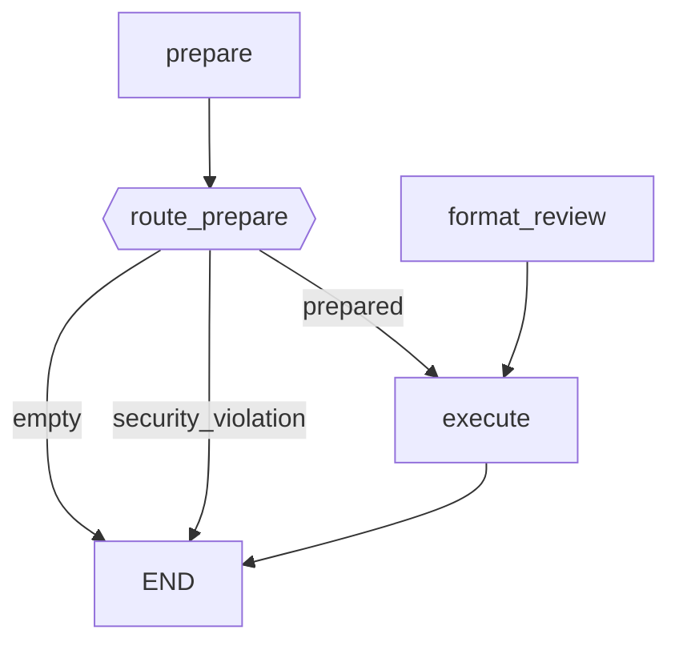

# DynamicGraphBuilder - LangGraph Workflow Builder

> Dynamic workflow construction using fluent API.

## Overview

`DynamicGraphBuilder` provides a declarative, fluent API for constructing LangGraph state machines at runtime. It abstracts away the complexity of node wrapping and edge definition.

## Quick Start

```python
from agent.core.orchestrator.builder import DynamicGraphBuilder

builder = DynamicGraphBuilder(skill_manager)
builder.add_skill_node("fetch", "filesystem", "read_file", {"path": "main.py"})
builder.add_skill_node("analyze", "code_tools", "find_tools")
builder.add_sequence("fetch", "analyze")
graph = builder.compile()
```

## Architecture

```
┌─────────────────────────────────────────────────────────────────┐
│                    DynamicGraphBuilder                           │
├─────────────────────────────────────────────────────────────────┤
│  Nodes:                                                          │
│  ├── add_skill_node()    - Skill command as node                │
│  ├── add_function_node() - Python function as node              │
│  ├── add_interrupt_node() - Human-in-the-Loop pause             │
│  ├── add_command_node()  - Dynamic routing with Command         │
│  └── add_llm_node()      - LLM processing node                  │
├─────────────────────────────────────────────────────────────────┤
│  Edges:                                                          │
│  ├── set_entry_point()   - Set starting node                    │
│  ├── add_edge()          - Direct node connection               │
│  ├── add_sequence()      - Linear sequence                      │
│  ├── add_conditional_edges() - Branching logic                  │
│  └── add_send_branch()   - Parallel execution                   │
├─────────────────────────────────────────────────────────────────┤
│  Compilation:                                                    │
│  └── compile()           - Returns CompiledGraph                │
└─────────────────────────────────────────────────────────────────┘
```

## Node Types

### 1. Skill Node

Execute skill commands as graph nodes.

```python
builder.add_skill_node(
    node_name="read_file",
    skill_name="filesystem",
    command_name="read_file",
    fixed_args={"encoding": "utf-8"},
    state_input={"path": "file_path"},      # Read from state
    state_output={"content": "file_content"},  # Write to state
)
```

**State Flow:**

```python
# Input state
{"file_path": "main.py"}

# Node reads file_path from state, executes skill
# Output state
{"file_content": "...", "scratchpad": [...]}
```

### 2. Function Node

Add custom Python functions as nodes.

```python
async def analyze_content(state):
    content = state.get("file_content", "")
    return {
        "analysis": f"Analyzed {len(content)} chars",
        "line_count": content.count("\n") + 1
    }

builder.add_function_node("analyze", analyze_content)
```

### 3. Interrupt Node (Human-in-the-Loop)

Pause execution for human approval.

```python
builder.add_interrupt_node(
    "human_review",
    "Please review the changes and approve",
    resume_key="approval"
)
```

**Usage:**

```python
# Graph pauses at interrupt, resume with:
command = graph.resume("approved")
async for chunk in graph.stream(command, config):
    print(chunk)
```

### 4. Command Node

Dynamic routing with `Command` pattern.

```python
from langgraph.types import Command

async def conditional_commit(state):
    if state.get("approved"):
        return Command(update={"status": "committed"}, goto="END")
    return Command(update={"status": "skipped"}, goto="END")

builder.add_command_node("check_approval", conditional_commit)
```

**Command Options:**

- `Command(update={...}, goto="next_node")` - Update state and continue
- `Command(resume=value)` - Resume from interrupt
- `Command(goto="specific_node")` - Jump to any node

### 5. LLM Node

Direct LLM processing in the graph.

```python
builder.add_llm_node(
    "summarize",
    prompt_template="Summarize this: {{file_content}}",
    model="claude-sonnet",
    state_output="summary"
)
```

## Edge Types

### Direct Edge

```python
builder.add_edge("node_a", "node_b")
```

### Sequence

```python
builder.add_sequence("node_a", "node_b", "node_c", "node_d")
# Creates: A -> B -> C -> D
```

### Conditional Edges

```python
def route_by_status(state):
    if state.get("security_issues"):
        return "security_alert"
    elif not state.get("staged_files"):
        return "empty_state"
    return "execute"

builder.add_conditional_edges(
    "prepare",
    route_by_status,
    {
        "security_alert": "security_alert",
        "empty_state": "END",
        "execute": "execute"
    }
)
```

### Send Branch (Parallel)

```python
def spawn_tasks(state):
    return [
        Send("lint_file", {"path": f})
        for f in state.get("changed_files", [])
    ]

builder.add_send_branch("parallel_lint", ["lint_file"], spawn_tasks)
```

## State Schema with Reducers

For parallel node writes, use reducers:

```python
from agent.core.orchestrator.state_utils import create_reducer_state_schema
import operator

# Create schema with list accumulation
state_schema = create_reducer_state_schema(
    GraphState,
    {
        "files": operator.add,  # Accumulates list items
        "results": lambda d, u: d.update(u) or d,  # Merges dicts
    }
)

builder = DynamicGraphBuilder(
    skill_manager,
    state_schema=state_schema
)
```

## Human-in-the-Loop Pattern

```python
from langgraph.types import Command

builder = DynamicGraphBuilder(skill_manager, checkpoint=True)

# Stage files
builder.add_skill_node("stage", "git", "stage_all")

# Human review
builder.add_interrupt_node("review", "Please approve the commit")

# Conditional commit
async def check_approval(state):
    approval = state.get("approval", "").lower()
    if approval in ["approved", "yes", "y"]:
        return Command(update={"status": "ready"}, goto="commit")
    return Command(update={"status": "cancelled"}, goto=END)

builder.add_command_node("check", check_approval)
builder.add_skill_node("commit", "git", "commit")

builder.add_sequence("stage", "review", "check")
builder.set_entry_point("stage")
graph = builder.compile(interrupt_before=["commit"])
```

### Execute with Interrupt

```python
import asyncio
from langgraph.types import Command

async def run_with_approval():
    # Start the workflow
    config = {"configurable": {"thread_id": "commit-123"}}

    async for chunk in graph.stream({"root_dir": "."}, config):
        print(chunk)

    # Check for interrupt
    if graph.has_interrupt(config):
        print("Waiting for human approval...")
        # Human provides approval...
        command = Command(resume="approved")

        async for chunk in graph.stream(command, config):
            print(chunk)

asyncio.run(run_with_approval())
```

## Smart Commit Example

Complete workflow with security scan and human approval:

```python
from agent.core.orchestrator.builder import DynamicGraphBuilder

builder = DynamicGraphBuilder(skill_manager, checkpoint=True)

# Node 1: Stage and scan
builder.add_skill_node(
    "prepare",
    "git",
    "stage_and_scan",
    state_output={
        "staged_files": "staged_files",
        "security_issues": "security_issues",
        "diff": "diff_content",
    }
)

# Node 2: Route based on scan result
async def route_prepare(state):
    if state.get("security_issues"):
        return {"status": "security_violation"}
    if not state.get("staged_files"):
        return {"status": "empty"}
    return {"status": "prepared"}

builder.add_function_node("route_prepare", route_prepare)

# Node 3: Format review card
async def format_review(state):
    status = state.get("status")
    if status == "prepared":
        files = state.get("staged_files", [])
        return {"review_card": f"**{len(files)} Files to commit**"}
    return {"review_card": f"**Status**: {status}"}

builder.add_function_node("format_review", format_review)

# Node 4: Execute commit (after approval)
builder.add_skill_node("execute", "git", "commit")

# Edges
builder.add_sequence("prepare", "route_prepare", "format_review")
builder.add_conditional_edges(
    "route_prepare",
    lambda s: "execute" if s.get("status") == "prepared" else END,
    {"execute": "execute", END: END}
)
builder.add_edge("execute", END)

# Compile with interrupt before execute
graph = builder.compile(
    interrupt_before=["execute"],
    thread_id="smart-commit"
)

# Visualize
print(builder.visualize())
```

### Mermaid Output



## Compilation Options

```python
graph = builder.compile(
    interrupt_before=["sensitive_node"],  # Pause before node
    interrupt_after=["review_node"],       # Pause after node
    thread_id="workflow-123",              # Thread ID for checkpointer
    checkpointer=MemorySaver()             # Custom checkpointer
)
```

## CompiledGraph API

```python
# Configuration
config = graph.get_config("thread-123")

# State management
state = graph.get_state("thread-123")
next_node = graph.get_next_node("thread-123")

# Interrupt handling
has_int = graph.has_interrupt("thread-123")
value = graph.get_interrupt_value("thread-123")

# Execution
result = await graph.invoke({"input": "data"})
async for chunk in graph.stream({"input": "data"}):
    print(chunk)

# Resume from interrupt
command = graph.resume("approved", update={"note": "LGTM"})
# Or goto specific node
command = graph.goto("review_node", update={"status": "approved"})
```

## Best Practices

1. **Use skill nodes for existing commands** - Leverage `@skill_command` decorated functions
2. **Use function nodes for simple logic** - Keep them focused and async
3. **Use command nodes for dynamic routing** - When you need to jump to any node
4. **Always set entry point** - Or use single-node shortcut
5. **Use interrupt for human approval** - Essential for destructive operations
6. **Enable checkpoint for long workflows** - Allows state recovery
7. **Visualize before compiling** - Catch design errors early

## Error Handling

```python
try:
    graph = builder.compile()
except RuntimeError as e:
    if "already compiled" in str(e):
        # Create new builder
        builder = DynamicGraphBuilder(skill_manager)
    else:
        raise
```

## See Also

- [LangGraph Documentation](https://langchain-ai.github.io/langgraph/)
- [Smart Commit Workflow](../skills/git/scripts/graph_workflow.py)
- [State Schema Utilities](state_utils.py)
