# Agent vs Skill: Architectural Decision

> **Status**: ⚠️ PARTIALLY LEGACY - Core concepts still relevant, terminology may have evolved
> **See Also**: `trinity-architecture.md` for current skill architecture

---

> A deep analysis of why Reviewer should be an Agent (Worker), not a Skill (Tool).

This document explains a fundamental distinction in **Agentic Architecture** that often causes confusion: **Role (Agent)** vs **Capability (Skill)**.

## The Short Answer

**Reviewer should be an Agent (Worker), not a Skill (Tool).**

Implementing `ReviewerAgent` in `packages/python/agent/src/agent/core/agents/reviewer.py` follows Anthropic's **Orchestrator-Workers** pattern best practices.

---

## 1. Role vs Capability

### Skill (Capability/Toolbox)

| Aspect             | Description                                                                   |
| ------------------ | ----------------------------------------------------------------------------- |
| **Definition**     | Passive, deterministic, atomic capability                                     |
| **Examples**       | `git` (execute commands), `file_ops` (read/write), `linter` (static analysis) |
| **Characteristic** | Skills have no "subjective initiative"                                        |

A `git commit` doesn't think "is this code garbage?" It only commits.

### Agent (Role/Worker)

| Aspect             | Description                                                   |
| ------------------ | ------------------------------------------------------------- |
| **Definition**     | Active, reasoning-capable, goal-oriented entity               |
| **Examples**       | `CoderAgent` (architect), `ReviewerAgent` (quality inspector) |
| **Characteristic** | Agents use LLM for **thinking**                               |

Reviewer needs to read code, understand intent, evaluate quality based on experience. This is a **Cognitive Process**, not a tool invocation.

### Consequences of Wrong Abstraction

If Reviewer is a Skill:

```
Orchestrator calls call_tool("review_code")
```

This encapsulates "thinking" in a black-box function. This works in simple Chains, but in complex Agent systems, we want Workers to be **first-class citizens** that can be:

- Commanded
- Given feedback
- Retried

---

## 2. Context & Responsibility

In **Phase 15 (Reflexion Loop)**, Reviewer's responsibility isn't just "output a comment"—it's the **Gatekeeper** role.

### ReviewerAgent Workflow

```mermaid
flowchart TD
    User --> Orchestrator
    Orchestrator -- Task Brief --> Coder[👷 CoderAgent]
    Coder -- Code --> Orchestrator

    subgraph Phase 15 Loop
        Orchestrator -- Audit Request --> Reviewer[🕵️ ReviewerAgent]
        Reviewer -- Uses --> Skill1[🔧 git skill]
        Reviewer -- Uses --> Skill2[🔧 testing skill]
        Reviewer -- Feedback --> Orchestrator
    end

    Orchestrator -- Retry if rejected --> Coder
```



### Who Decides Tool Usage?

If Reviewer were just a Skill, who decides when to call `git` and `testing`?

| Option           | Problem                                              |
| ---------------- | ---------------------------------------------------- |
| **Orchestrator** | God object—becomes too bloated                       |
| **Coder**        | Self-review (left hand checks right hand)—unreliable |

**Solution:** Only independent `ReviewerAgent` can hold a separate "QA Context" and fairly invoke testing tools for audit.

---

## 3. Scalability & Future Extensions

Defining Reviewer as an Agent enables powerful extensions:

### Human-in-the-loop

```python
class ReviewerAgent(BaseAgent):
    async def audit(self, task, agent_output):
        confidence = await self._assess_confidence(agent_output)
        if confidence < 0.7:
            return await self._request_human_review()
        return await self._auto_approve()
```

### Specialized Reviewers

```python
class SecurityReviewerAgent(ReviewerAgent):
    """Focuses on security vulnerabilities."""
    default_skills = ["security_scanner", "dependency_check"]

class PerformanceReviewerAgent(ReviewerAgent):
    """Focuses on performance optimization."""
    default_skills = ["profiler", "benchmark"]
```

Both are Agent subclasses—just mount different Skills and Prompts.

---

## 4. Recommended Architecture

### Current Implementation (Correct)

```
packages/python/agent/src/agent/core/agents/
├── base.py           # BaseAgent, AgentContext, AgentResult, AuditResult
├── coder.py          # 👷 CoderAgent (filesystem, file_ops, python_engineering)
└── reviewer.py       # 🕵️ ReviewerAgent (git, testing, linter, documentation)
```

### Optional Enhancement: Configurable Standards

If you want review standards to be configurable (DRY principle):

```
agent/skills/
├── git/
├── testing/
└── audit_standards/          # Optional: Review standards as a "skill"
    ├── prompts.md            # Defines quality criteria
    └── SKILL.yaml            # Skill metadata (Phase 33)
```

ReviewerAgent loads `audit_standards` just like any other skill.

---

## 5. Comparison Table

| Aspect          | Skill (Tool)   | Agent (Worker)          |
| --------------- | -------------- | ----------------------- |
| **Initiative**  | Passive        | Active                  |
| **Reasoning**   | Deterministic  | LLM-based               |
| **Tool Usage**  | Is a tool      | Uses tools              |
| **Context**     | Stateless      | Stateful                |
| **Retry Logic** | External       | Internal                |
| **Example**     | `git.commit()` | `ReviewerAgent.audit()` |

---

## Conclusion

The current architecture is **correct by design**:

1. **Agent** = Role (What is this entity responsible for?)
2. **Skill** = Capability (What tools can this entity use?)

Reviewer as an Agent:

- Has **independent thinking** (uses LLM)
- Holds **QA Context** (impartial perspective)
- Uses **Skills** (`git`, `testing`, `linter`)
- Enables **Feedback Loop** (self-correction retry)

This follows **Orchestrator-Workers** pattern—Reviewer is a "prosecutor" with independent thinking and tool usage rights, not just a "inspection script."

---

## Related Documentation

- [Orchestrator Architecture](../reference/mcp-orchestrator.md)
- [Phase 15: Reflexion Loop](phase15-reflexion-loop.md)
- [Skill Registry Pattern](../reference/skill-registry.md)
