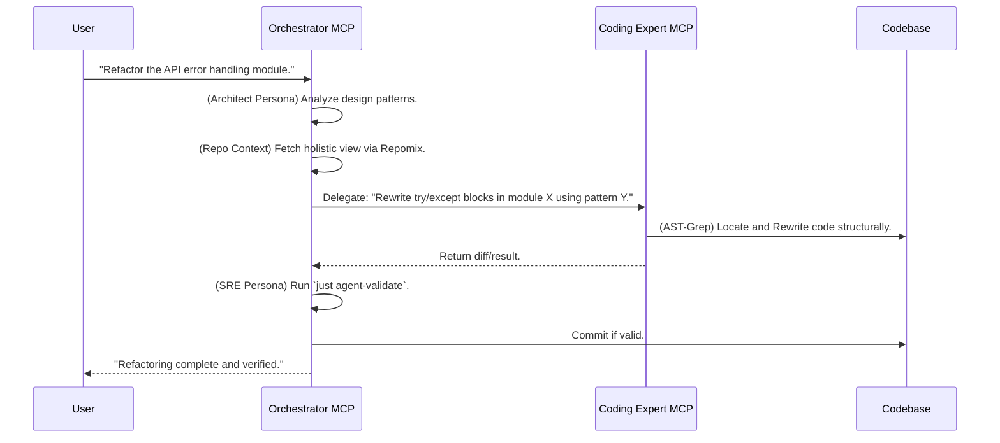

# Design & Roadmap: Bi-MCP Architecture

> **Philosophy**: Separation of Concerns. "Macro" orchestration vs. "Micro" surgical coding.
> **Status**: Phase 13.9 (Modular Entrypoint)

This document outlines the architectural vision for `omni-dev-fusion`. We move from a single monolithic MCP server to a specialized dual-server setup. This design acts as a **Bridge** between generic LLM capabilities and the strict requirements of our Nix-based project environment.

---

## The Problem We Solve

Generic AI doesn't understand your project's context. It writes code that doesn't match your stack.

```bash
# You ask the AI
> Deploy to K8s

# AI creates this (wrong stack!)
> helm install myapp ./chart
# But your project uses Kustomize + Nix!
```

The Bridge Pattern solves this by routing through personas that understand your project's conventions.

---

## Bi-MCP Architecture

The system divides into two distinct MCP servers, each serving a specific abstraction level.

| Server           | Focus                                | Role                                        |
| ---------------- | ------------------------------------ | ------------------------------------------- |
| **Orchestrator** | SDLC, DevOps, SRE, Architecture      | High-level decision making, context, skills |
| **Coder**        | Code implementation, AST refactoring | Precise execution, surgical precision       |

**Key Difference from Tri-MCP:**

| Aspect     | Tri-MCP (Old)                   | Bi-MCP (Current)                           |
| ---------- | ------------------------------- | ------------------------------------------ |
| Servers    | orchestrator + executor + coder | orchestrator + coder                       |
| Operations | Direct tools in executor        | Skills via `skill()` in orchestrator       |
| Git        | executor: git_status            | orchestrator: skill("git", "git_status()") |

### Server A: The Orchestrator (The "Brain")

- **Focus**: SDLC, DevOps, MLOps, SRE, Architecture, Policy Enforcement.
- **View**: "Macro." Uses `Repomix` to see the forest, not the trees.

**Core Responsibilities:**

| Responsibility            | Description                                                  |
| ------------------------- | ------------------------------------------------------------ |
| **SDLC Guardrails**       | Enforce "Plan -> Consult -> Implement -> Validate" loop      |
| **Context Aggregation**   | Fetch holistic project views via `get_codebase_context`      |
| **Specialist Delegation** | Route queries to personas (Architect, Platform, DevOps, SRE) |
| **Execution Management**  | Safely trigger `just` commands to verify changes             |
| **Skill Orchestration**   | Dynamic loading/unloading of Skills based on user intent     |

**The Bridge Role:**

| Capability                | Implementation                                                    |
| ------------------------- | ----------------------------------------------------------------- |
| **Contextual Adaptation** | Translate "Deploy to K8s" → "Configure devenv.nix + helm modules" |
| **Policy Enforcement**    | Reject commits that violate `CLAUDE.md` rules                     |
| **Skill Loading**         | Load `skills/git_operations` when user says "commit"              |

### Server B: The Coder (The "Hands")

- **Focus**: High-quality code, AST-based refactoring, Performance, Security.
- **View**: "Micro." Uses `ast-grep` for surgical precision.

**Core Responsibilities:**

| Responsibility           | Description                                              |
| ------------------------ | -------------------------------------------------------- |
| **Surgical Refactoring** | Structural code changes, not line-based text replacement |
| **Quality Assurance**    | Apply linters (`ruff`, `nixfmt`) before returning code   |
| **Security Scanning**    | Detect hardcoded secrets or unsafe patterns              |

**The Bridge Role:**

| Capability                   | Implementation                                              |
| ---------------------------- | ----------------------------------------------------------- |
| **Syntax Adaptation**        | Match code to `treefmt.toml` or `.editorconfig`             |
| **Performance Optimization** | Optimize patterns (e.g., Python `uv` dependency management) |

---

## Interaction Workflow

The Orchestrator plans, the Coder executes, and both validate.

### Router-Augmented Coding (Phase 4+)

The `lang_expert` tool implements a three-layer knowledge system for language-specific code:

```mermaid
graph LR
    A[Agent: "Add mkNixago config"] --> B[lang_expert]
    B --> C[L1: Standards]
    B --> D[L2: Examples]
    C --> E[agent/standards/lang-nix.md]
    D --> F[tool-router/data/examples/nix.edit.jsonl]
    E --> G[Project conventions]
    F --> H[Concrete patterns]
    G --> I[Combined context]
    H --> I
    I --> J[High-quality code]
```

**Usage**:

```
@omni-orchestrator consult_language_expert file_path="lefthook.nix" task="extend generator"
```

Returns:

- L1: mkNixago patterns, forbidden patterns from `agent/standards/lang-nix.md`
- L2: Relevant examples from `tool-router/data/examples/nix.edit.jsonl`

**Benefits**:

- Prevents common mistakes (e.g., `with pkgs;`, full dmerge override)
- Provides concrete examples for complex patterns
- Decouples knowledge from prompts



---

## Phase 13+: The Skill-First Reformation

> **Philosophy**: "Don't Build Agents, Build Skills." - Anthropic
> **Status**: Phase 13.9 Complete

### The Problem: Agent-Centric Limitations

As we scale, the "Persona-based Agent" metaphor hits a wall:

| Problem           | Symptom                                                      |
| ----------------- | ------------------------------------------------------------ |
| **Context Bloat** | All tools loaded simultaneously degrades reasoning           |
| **Rigidity**      | "Engineer Agent" is too broad - knows everything and nothing |
| **Duplication**   | QA and Dev agents both need file reading capabilities        |

### The Solution: Skill-Centric Architecture

We evolve from **"Building Agents"** to **"Building Skills"**:

```
Runtime (No fixed personality)
     ↓
Dynamic Skill Loading (load only what's needed)
     ↓
Skills: git_operations, python_engineering, debugging, ...
     ↓
Constant context cost regardless of skill count
```

### Phase 13.9: Modular Entrypoint (COMPLETED)

The Orchestrator is now a **pure Composition Root**:

```
main.py (87 lines)
    │
    ├── 1. Core Infrastructure
    │   ├── bootstrap.py → boot_core_skills(), start_background_tasks()
    │   └── context_loader.py → load_system_context()
    │
    ├── 2. Capabilities (Domain Logic)
    │   ├── product_owner, lang_expert, librarian
    │   ├── harvester, skill_manager, reviewer
    │
    ├── 3. Core Tools (Operational)
    │   ├── context, spec, router, execution, status
    │
    └── 4. Skills (Dynamic)
            └── filesystem, git, terminal, testing_protocol (auto-boot)
```

### The skill() Tool

Operations are accessed via the `skill()` tool instead of direct tool calls:

```json
{
  "tool": "skill",
  "arguments": {
    "skill": "git",
    "call": "smart_commit(message='feat(scope): description')"
  }
}
```

**Available Core Skills:**

| Skill              | Purpose           | Tools                                                |
| ------------------ | ----------------- | ---------------------------------------------------- |
| `git`              | Version control   | git_status, git_log, git_add, smart_commit           |
| `terminal`         | Command execution | execute_command, inspect_environment                 |
| `testing_protocol` | Test runner       | smart_test_runner, run_test_command                  |
| `writer`           | Writing quality   | lint_writing_style, polish_text, load_writing_memory |
| `filesystem`       | File operations   | list_directory, read_file, write_file                |

### What is a Skill?

A Skill is a self-contained package of capability:

```
agent/skills/{skill_name}/
├── manifest.json              # Metadata: name, version, tools, dependencies
├── guide.md                   # Procedural knowledge (LLM's "manual")
├── tools.py                   # Executable tools ("hands")
├── prompts.md                 # Context injection when active
└── tests/                     # Self-contained tests
```

### Phase 13 Roadmap: The Foundation (Skill Kernel)

| Milestone      | Status      | Description                                             |
| -------------- | ----------- | ------------------------------------------------------- |
| Skill Registry | Completed   | Auto-discover skills in `agent/skills/`                 |
| Core Skills    | Completed   | git_operations, python_engineering, filesystem          |
| Skill Tools    | Completed   | `list_skills()`, `load_skill()`, `get_skill_manifest()` |
| Dynamic Loader | Pending     | Orchestrator dynamically loads/unloads skills           |
| Tool Migration | In Progress | Port existing tools to Skill format                     |

**Acceptance Criteria:**

- `agent/skills/` contains at least 3 core skills
- `list_skills()` and `load_skill()` tools available
- Orchestrator demonstrates dynamic skill loading

### Phase 14 Roadmap: The Skill Explosion

| Milestone           | Description                                                                |
| ------------------- | -------------------------------------------------------------------------- |
| **Language Skills** | Migrate `agent/standards/lang-*.md` to `skills/rust/`, `skills/nix/`, etc. |
| **Workflow Skills** | Create `skills/documentation/`, `skills/testing/`, `skills/release/`       |
| **Harvester V2**    | Auto-update skill `README.md` based on execution results                   |

### Phase 15 Roadmap: Autonomy

| Milestone                 | Description                                      |
| ------------------------- | ------------------------------------------------ |
| **Task Weaver**           | Project management skill with SQLite persistence |
| **Recursive Delegation**  | Weaver can load other skills for subtasks        |
| **Self-Improving Skills** | Skills that evolve based on experience           |

---

## Toolset Roadmap

### Orchestrator Tools

| Tool                    | Status   | Purpose                                              |
| ----------------------- | -------- | ---------------------------------------------------- |
| `consult_specialist`    | Existing | Multi-persona routing                                |
| `consult_router`        | Existing | Semantic tool routing (Cortex)                       |
| `manage_context`        | Existing | Project context management                           |
| `lang_expert`           | Existing | Router-Augmented Coding (L1 Standards + L2 Examples) |
| `skill`                 | New      | Execute skill operations                             |
| `list_available_skills` | Existing | Discover available skills                            |
| `load_skill`            | Existing | Load skill context (guide + tools + prompts)         |
| `orchestrator_status`   | New      | System status introspection (Phase 13.9)             |
| `review_staged_changes` | Existing | AI-powered code review (Immune System)               |

### Coder Tools

| Tool           | Status   | Purpose                                        |
| -------------- | -------- | ---------------------------------------------- |
| `ast_search`   | Existing | Query code structure using `ast-grep` patterns |
| `ast_rewrite`  | Existing | Apply structural patches via AST               |
| `read_file`    | Existing | Lightweight single-file reading                |
| `search_files` | Existing | Pattern search (grep-like)                     |
| `save_file`    | Existing | Write with backup and syntax validation        |

---

## Why Bi-MCP?

| Challenge            | Single Server                      | Bi-MCP Solution                                     |
| -------------------- | ---------------------------------- | --------------------------------------------------- |
| **Context overload** | One server handles all tools       | Orchestrator aggregates; Coder executes surgically  |
| **Role confusion**   | Same tools for planning and coding | Specialized servers for each domain                 |
| **Latency**          | N+1 tool calls for complex tasks   | Parallel context fetching via Repomix               |
| **Quality**          | Generic code generation            | AST-based refactoring ensures syntactic correctness |
| **Scalability**      | All tools always loaded            | Dynamic skill loading keeps context constant        |

---

## Next Steps

1. **Phase 13**: Complete the Skill Foundation
   - Implement dynamic skill loader in Orchestrator
   - Migrate remaining tools to Skill format
   - Create language skills (Rust, Nix, Julia)

2. **Phase 14**: Skill Explosion
   - Create workflow skills (Documentation, Testing, Release)
   - Implement Harvester V2 for self-improving skills

3. **Phase 15**: Autonomy
   - Build Task Weaver skill
   - Enable recursive skill delegation

See [`why-custom-mcp-architecture.md`](./why-custom-mcp-architecture.md) for the rationale behind this design.
See [`design-philosophy.md`](./design-philosophy.md) for the three interaction patterns.

---

## Phase 14: The Telepathic Link (Mission Brief Protocol)

> **Status**: Phase 14.0 Complete
> **Philosophy**: "Don't make the Worker re-think what the Router already figured out."

### The Pain: Context Distillation Loss

**The Problem:**

```
User: "Fix this bug, it's an IndexError."

Router (LLM): (Thinks: Python issue, needs file_ops and git) → Activates Skills.

Worker (Main LLM): (Wakes up, sees tools) "Hello, what do you want?
                    Oh, fix a bug. Let me re-analyze this IndexError..."
```

**The Waste:**

- Router spent 2 seconds understanding: "IndexError in src/main.py, need read_file + write_file + git_commit"
- Worker receives: `["file_ops", "git"]` (a tool list only)
- Worker re-analyzes: "User wants me to fix a bug... What bug? IndexError? Which file?"

**The Solution: Mission Brief**

Router not only returns skill list, but generates a one-sentence tactical directive, directly injected into Worker's System Prompt.

---

### Before vs After

#### ❌ Before (Phase 13.9)

```
User: "commit my changes with message 'feat(api): add auth'"

Router → Worker:
  skills: ["git"]
  (Worker must self-analyze: "User wants to commit... need git_commit tool")

Worker's inner monologue:
  1. "I have git tools... which one specifically? git_status? git_push? git_commit?"
  2. "User said 'commit my changes'... should be git_commit"
  3. "Parameter is message='feat(api): add auth'... call directly"
  4. "Wait, should I show analysis for confirmation first?"
  5. (Starts reading git skill prompts.md...)
```

#### ✅ After (Phase 14.0)

```
User: "commit my changes with message 'feat(api): add auth'"

Router → Worker:
  skills: ["git"]
  mission_brief: "Commit the staged changes with message
                  'feat(api): add auth'. BEFORE committing,
                  show commit analysis (Type, Scope, Message)
                  for user confirmation. Then execute git_commit."

Worker's inner monologue:
  1. Sees mission_brief: "Oh! User wants to commit, and needs analysis first"
  2. Executes directly: git_status → show analysis → wait confirm → git_commit
  3. No reading docs, no guessing intent
```

---

### How It Works

#### 1. Router Generates Mission Brief

```python
# router.py - SemanticRouter.route()
system_prompt = """
...
MISSION BRIEF GUIDELINES:
- Be SPECIFIC and ACTIONABLE (not generic)
- Tell the Worker WHAT to do and WHY
- Include specific file paths or parameters if mentioned
- Example: "Fix the IndexError in src/main.py line 42.
            Use grep to locate, read_file to inspect, then write the fix."

OUTPUT FORMAT:
{
    "skills": ["git"],
    "mission_brief": "Actionable directive...",
    "confidence": 0.85,
    "reasoning": "Why these skills were chosen..."
}
"""
```

#### 2. Context Builder Injects Brief

```python
# context_builder.py - Mission Injection
def build_mission_injection(routing_result):
    return f"""
╔═══════════════════════════════════════════════════════════════╗
║ 🚀 MISSION BRIEF (from Orchestrator)                          ║
╠═══════════════════════════════════════════════════════════════╣
║ 🟢 HIGH CONFIDENCE | Skills: git                              ║
╠═══════════════════════════════════════════════════════════════╣
║                                                               ║
║ 📋 YOUR OBJECTIVE:                                            ║
║ Commit the staged changes with message 'feat(api): add auth'. ║
║ BEFORE committing, show commit analysis for confirmation.     ║
║                                                               ║
╚═══════════════════════════════════════════════════════════════╝
"""
```

---

### The Hive Mind Cache

**Problem:** High-frequency queries (like "run tests", "commit", "check status") don't need LLM inference every time.

**Solution:** LRU Cache for routing decisions.

```python
# First call "run tests": ~2s (calls LLM)
# Second call "run tests": ~0ms (cache hit)
# 5 consecutive calls: 0ms ⚡

router = get_router()
result = await router.route("run the tests")
# result.from_cache == True (if second call)
```

**Usage:**

```bash
# Test cache behavior
python scripts/test_router.py --cache
```

---

### Real Examples from test_router.py

```bash
# Example 1: Commit with confirmation
$ python scripts/test_router.py --query "commit my changes with message 'feat(api): add auth'"

🎯 ROUTING RESULT:
   Skills: ['git']
   Confidence: 1.00
   From Cache: No

📋 MISSION BRIEF:
   Commit the staged changes with message 'feat(api): add auth'.
   Before committing, show commit analysis (Type: feat, Scope: api,
   Message: add auth) for user confirmation. Then execute git_commit.

💭 REASONING:
   User explicitly requested to commit with a specific message.

---

# Example 2: Cache Hit (instant)
$ python scripts/test_router.py --cache

1️⃣ First call (expect MISS):
   From Cache: False
2️⃣ Second call (expect HIT):
   From Cache: True
4️⃣ Performance:
   5 cached calls: 0.0ms (should be near-instant)
```

---

### API Reference

#### RoutingResult

```python
@dataclass
class RoutingResult:
    selected_skills: List[str]   # Skill list
    mission_brief: str            # 🚀 Mission brief
    reasoning: str                # Decision rationale
    confidence: float             # 0.0-1.0
    from_cache: bool              # Cache hit flag
    timestamp: float              # Timestamp
```

#### Core Functions

```python
from agent.core.router import get_router, clear_routing_cache

# Basic routing
router = get_router()
result = await router.route("fix the IndexError")

# result.selected_skills  → ["file_ops", "git"]
# result.mission_brief    → "Fix the IndexError in src/main.py..."
# result.from_cache       → False

# Clear cache
clear_routing_cache()
```

#### Context Builder

```python
from agent.core.context_builder import (
    build_mission_injection,
    build_worker_context,
    route_and_build_context,
)

# One-shot route + build context
result = await route_and_build_context(
    user_query="fix the IndexError",
    chat_history=history,
)

# result = {
#     "routing_result": RoutingResult(...),
#     "context": "Full context (with Mission Brief)",
#     "skills": ["file_ops", "git"],
#     "mission_brief": "Fix the IndexError..."
# }
```

---

### Test Suite

```bash
# Run all routing tests
python scripts/test_router.py --all

# Test cache behavior
python scripts/test_router.py --cache

# Test Mission Brief quality
python scripts/test_router.py --brief

# Interactive mode
python scripts/test_router.py --interactive
```

**Test Results:**

| Test                  | Status            |
| --------------------- | ----------------- |
| Routing (23 cases)    | ✅ 23/23          |
| Cache Hit             | ✅ 0ms            |
| Mission Brief Quality | ✅ All actionable |

---

### When to Use

| Scenario             | Use Mission Brief? |
| -------------------- | ------------------ |
| Simple file read     | ❌ Not needed      |
| Commit with analysis | ✅ Essential       |
| Complex bug fix      | ✅ Essential       |
| Testing workflow     | ✅ Essential       |
| General conversation | ❌ Overkill        |
