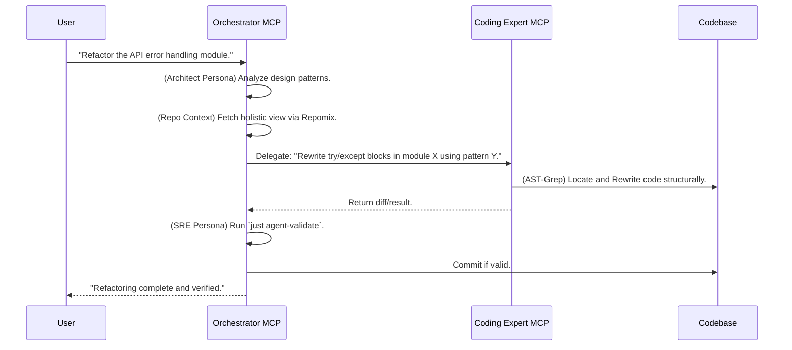

# Design & Roadmap: Bi-MCP Architecture

> **Philosophy**: Separation of Concerns. "Macro" orchestration vs. "Micro" surgical coding.
> **Status**: Phase 13.9 (Modular Entrypoint)

This document outlines the architectural vision for `omni-dev-fusion`. We move from a single monolithic MCP server to a specialized dual-server setup. This design acts as a **Bridge** between generic LLM capabilities and the strict requirements of our Nix-based project environment.

---

## The Problem We Solve

Generic AI doesn't understand your project's context. It writes code that doesn't match your stack.

```bash
# You ask the AI
> Deploy to K8s

# AI creates this (wrong stack!)
> helm install myapp ./chart
# But your project uses Kustomize + Nix!
```

The Bridge Pattern solves this by routing through personas that understand your project's conventions.

---

## Bi-MCP Architecture

The system divides into two distinct MCP servers, each serving a specific abstraction level.

| Server           | Focus                                | Role                                          |
| ---------------- | ------------------------------------ | --------------------------------------------- |
| **Orchestrator** | SDLC, DevOps, SRE, Architecture      | High-level decision making, context, skills   |
| **Coder**        | Code implementation, AST refactoring | Precise execution, surgical precision         |

**Key Difference from Tri-MCP:**

| Aspect     | Tri-MCP (Old)              | Bi-MCP (Current)                          |
| ---------- | -------------------------- | ----------------------------------------- |
| Servers    | orchestrator + executor + coder | orchestrator + coder                 |
| Operations | Direct tools in executor   | Skills via `skill()` in orchestrator      |
| Git        | executor: git_status       | orchestrator: skill("git", "git_status()")|

### Server A: The Orchestrator (The "Brain")

- **Focus**: SDLC, DevOps, MLOps, SRE, Architecture, Policy Enforcement.
- **View**: "Macro." Uses `Repomix` to see the forest, not the trees.

**Core Responsibilities:**

| Responsibility            | Description                                                  |
| ------------------------- | ------------------------------------------------------------ |
| **SDLC Guardrails**       | Enforce "Plan -> Consult -> Implement -> Validate" loop      |
| **Context Aggregation**   | Fetch holistic project views via `get_codebase_context`      |
| **Specialist Delegation** | Route queries to personas (Architect, Platform, DevOps, SRE) |
| **Execution Management**  | Safely trigger `just` commands to verify changes             |
| **Skill Orchestration**   | Dynamic loading/unloading of Skills based on user intent     |

**The Bridge Role:**

| Capability                | Implementation                                                    |
| ------------------------- | ----------------------------------------------------------------- |
| **Contextual Adaptation** | Translate "Deploy to K8s" → "Configure devenv.nix + helm modules" |
| **Policy Enforcement**    | Reject commits that violate `CLAUDE.md` rules                     |
| **Skill Loading**         | Load `skills/git_operations` when user says "commit"              |

### Server B: The Coder (The "Hands")

- **Focus**: High-quality code, AST-based refactoring, Performance, Security.
- **View**: "Micro." Uses `ast-grep` for surgical precision.

**Core Responsibilities:**

| Responsibility           | Description                                              |
| ------------------------ | -------------------------------------------------------- |
| **Surgical Refactoring** | Structural code changes, not line-based text replacement |
| **Quality Assurance**    | Apply linters (`ruff`, `nixfmt`) before returning code   |
| **Security Scanning**    | Detect hardcoded secrets or unsafe patterns              |

**The Bridge Role:**

| Capability                   | Implementation                                              |
| ---------------------------- | ----------------------------------------------------------- |
| **Syntax Adaptation**        | Match code to `treefmt.toml` or `.editorconfig`             |
| **Performance Optimization** | Optimize patterns (e.g., Python `uv` dependency management) |

---

## Interaction Workflow

The Orchestrator plans, the Coder executes, and both validate.

### Router-Augmented Coding (Phase 4+)

The `lang_expert` tool implements a three-layer knowledge system for language-specific code:

```mermaid
graph LR
    A[Agent: "Add mkNixago config"] --> B[lang_expert]
    B --> C[L1: Standards]
    B --> D[L2: Examples]
    C --> E[agent/standards/lang-nix.md]
    D --> F[tool-router/data/examples/nix.edit.jsonl]
    E --> G[Project conventions]
    F --> H[Concrete patterns]
    G --> I[Combined context]
    H --> I
    I --> J[High-quality code]
```

**Usage**:

```
@omni-orchestrator consult_language_expert file_path="lefthook.nix" task="extend generator"
```

Returns:

- L1: mkNixago patterns, forbidden patterns from `agent/standards/lang-nix.md`
- L2: Relevant examples from `tool-router/data/examples/nix.edit.jsonl`

**Benefits**:

- Prevents common mistakes (e.g., `with pkgs;`, full dmerge override)
- Provides concrete examples for complex patterns
- Decouples knowledge from prompts



---

## Phase 13+: The Skill-First Reformation

> **Philosophy**: "Don't Build Agents, Build Skills." - Anthropic
> **Status**: Phase 13.9 Complete

### The Problem: Agent-Centric Limitations

As we scale, the "Persona-based Agent" metaphor hits a wall:

| Problem           | Symptom                                                      |
| ----------------- | ------------------------------------------------------------ |
| **Context Bloat** | All tools loaded simultaneously degrades reasoning           |
| **Rigidity**      | "Engineer Agent" is too broad - knows everything and nothing |
| **Duplication**   | QA and Dev agents both need file reading capabilities        |

### The Solution: Skill-Centric Architecture

We evolve from **"Building Agents"** to **"Building Skills"**:

```
Runtime (No fixed personality)
     ↓
Dynamic Skill Loading (load only what's needed)
     ↓
Skills: git_operations, python_engineering, debugging, ...
     ↓
Constant context cost regardless of skill count
```

### Phase 13.9: Modular Entrypoint (COMPLETED)

The Orchestrator is now a **pure Composition Root**:

```
main.py (87 lines)
    │
    ├── 1. Core Infrastructure
    │   ├── bootstrap.py → boot_core_skills(), start_background_tasks()
    │   └── context_loader.py → load_system_context()
    │
    ├── 2. Capabilities (Domain Logic)
    │   ├── product_owner, lang_expert, librarian
    │   ├── harvester, skill_manager, reviewer
    │
    ├── 3. Core Tools (Operational)
    │   ├── context, spec, router, execution, status
    │
    └── 4. Skills (Dynamic)
            └── filesystem, git, terminal, testing_protocol (auto-boot)
```

### The skill() Tool

Operations are accessed via the `skill()` tool instead of direct tool calls:

```json
{
  "tool": "skill",
  "arguments": {
    "skill": "git",
    "call": "smart_commit(message='feat(scope): description')"
  }
}
```

**Available Core Skills:**

| Skill | Purpose | Tools |
|-------|---------|-------|
| `git` | Version control | git_status, git_log, git_add, smart_commit |
| `terminal` | Command execution | execute_command, inspect_environment |
| `testing_protocol` | Test runner | smart_test_runner, run_test_command |
| `writer` | Writing quality | lint_writing_style, polish_text, load_writing_memory |
| `filesystem` | File operations | list_directory, read_file, write_file |

### What is a Skill?

A Skill is a self-contained package of capability:

```
agent/skills/{skill_name}/
├── manifest.json              # Metadata: name, version, tools, dependencies
├── guide.md                   # Procedural knowledge (LLM's "manual")
├── tools.py                   # Executable tools ("hands")
├── prompts.md                 # Context injection when active
└── tests/                     # Self-contained tests
```

### Phase 13 Roadmap: The Foundation (Skill Kernel)

| Milestone      | Status      | Description                                             |
| -------------- | ----------- | ------------------------------------------------------- |
| Skill Registry | Completed   | Auto-discover skills in `agent/skills/`                 |
| Core Skills    | Completed   | git_operations, python_engineering, filesystem          |
| Skill Tools    | Completed   | `list_skills()`, `load_skill()`, `get_skill_manifest()` |
| Dynamic Loader | Pending     | Orchestrator dynamically loads/unloads skills           |
| Tool Migration | In Progress | Port existing tools to Skill format                     |

**Acceptance Criteria:**

- `agent/skills/` contains at least 3 core skills
- `list_skills()` and `load_skill()` tools available
- Orchestrator demonstrates dynamic skill loading

### Phase 14 Roadmap: The Skill Explosion

| Milestone           | Description                                                                |
| ------------------- | -------------------------------------------------------------------------- |
| **Language Skills** | Migrate `agent/standards/lang-*.md` to `skills/rust/`, `skills/nix/`, etc. |
| **Workflow Skills** | Create `skills/documentation/`, `skills/testing/`, `skills/release/`       |
| **Harvester V2**    | Auto-update skill `README.md` based on execution results                   |

### Phase 15 Roadmap: Autonomy

| Milestone                 | Description                                      |
| ------------------------- | ------------------------------------------------ |
| **Task Weaver**           | Project management skill with SQLite persistence |
| **Recursive Delegation**  | Weaver can load other skills for subtasks        |
| **Self-Improving Skills** | Skills that evolve based on experience           |

---

## Toolset Roadmap

### Orchestrator Tools

| Tool                   | Status   | Purpose                                              |
| ---------------------- | -------- | ---------------------------------------------------- |
| `consult_specialist`   | Existing | Multi-persona routing                                |
| `consult_router`       | Existing | Semantic tool routing (Cortex)                       |
| `manage_context`       | Existing | Project context management                           |
| `lang_expert`          | Existing | Router-Augmented Coding (L1 Standards + L2 Examples) |
| `skill`                | New      | Execute skill operations                             |
| `list_available_skills`| Existing | Discover available skills                            |
| `load_skill`           | Existing | Load skill context (guide + tools + prompts)         |
| `orchestrator_status`  | New      | System status introspection (Phase 13.9)             |
| `review_staged_changes`| Existing | AI-powered code review (Immune System)               |

### Coder Tools

| Tool           | Status   | Purpose                                        |
| -------------- | -------- | ---------------------------------------------- |
| `ast_search`   | Existing | Query code structure using `ast-grep` patterns |
| `ast_rewrite`  | Existing | Apply structural patches via AST               |
| `read_file`    | Existing | Lightweight single-file reading                |
| `search_files` | Existing | Pattern search (grep-like)                     |
| `save_file`    | Existing | Write with backup and syntax validation        |

---

## Why Bi-MCP?

| Challenge            | Single Server                      | Bi-MCP Solution                                     |
| -------------------- | ---------------------------------- | --------------------------------------------------- |
| **Context overload** | One server handles all tools       | Orchestrator aggregates; Coder executes surgically  |
| **Role confusion**   | Same tools for planning and coding | Specialized servers for each domain                 |
| **Latency**          | N+1 tool calls for complex tasks   | Parallel context fetching via Repomix               |
| **Quality**          | Generic code generation            | AST-based refactoring ensures syntactic correctness |
| **Scalability**      | All tools always loaded            | Dynamic skill loading keeps context constant        |

---

## Next Steps

1. **Phase 13**: Complete the Skill Foundation
   - Implement dynamic skill loader in Orchestrator
   - Migrate remaining tools to Skill format
   - Create language skills (Rust, Nix, Julia)

2. **Phase 14**: Skill Explosion
   - Create workflow skills (Documentation, Testing, Release)
   - Implement Harvester V2 for self-improving skills

3. **Phase 15**: Autonomy
   - Build Task Weaver skill
   - Enable recursive skill delegation

See [`why-custom-mcp-architecture.md`](./why-custom-mcp-architecture.md) for the rationale behind this design.
See [`design-philosophy.md`](./design-philosophy.md) for the three interaction patterns.
