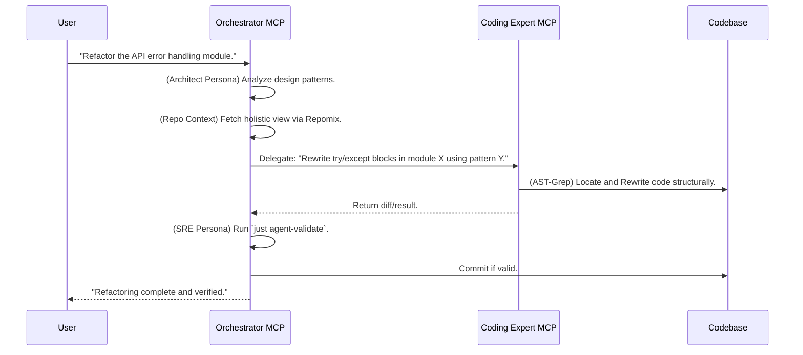

# Design & Roadmap: Bi-MCP Architecture

> **Philosophy**: Separation of Concerns. "Macro" orchestration vs. "Micro" surgical coding.
> **Status**: Phase 24 (The MiniMax Shift) - Direct Tool Registration

This document outlines the architectural vision for `omni-dev-fusion`. We move from a single monolithic MCP server to a specialized dual-server setup. This design acts as a **Bridge** between generic LLM capabilities and the strict requirements of our Nix-based project environment.

---

## The Problem We Solve

Generic AI doesn't understand your project's context. It writes code that doesn't match your stack.

```bash
# You ask the AI
> Deploy to K8s

# AI creates this (wrong stack!)
> helm install myapp ./chart
# But your project uses Kustomize + Nix!
```

The Bridge Pattern solves this by routing through personas that understand your project's conventions.

---

## Bi-MCP Architecture

The system divides into two distinct MCP servers, each serving a specific abstraction level.

| Server           | Focus                                | Role                                        |
| ---------------- | ------------------------------------ | ------------------------------------------- |
| **Orchestrator** | SDLC, DevOps, SRE, Architecture      | High-level decision making, context, skills |
| **Coder**        | Code implementation, AST refactoring | Precise execution, surgical precision       |

**Key Difference from Tri-MCP:**

| Aspect     | Tri-MCP (Old)                   | Bi-MCP (Current)                       |
| ---------- | ------------------------------- | -------------------------------------- |
| Servers    | orchestrator + executor + coder | orchestrator + coder                   |
| Operations | Direct tools in executor        | Direct tool registration (Phase 24)    |
| Git        | executor: git_status            | orchestrator: git_status()             |
| Tool Names | Descriptive text                | snake_case (e.g., `git_status_report`) |

### Server A: The Orchestrator (The "Brain")

- **Focus**: SDLC, DevOps, MLOps, SRE, Architecture, Policy Enforcement.
- **View**: "Macro." Uses `Repomix` to see the forest, not the trees.

**Core Responsibilities:**

| Responsibility            | Description                                                  |
| ------------------------- | ------------------------------------------------------------ |
| **SDLC Guardrails**       | Enforce "Plan -> Consult -> Implement -> Validate" loop      |
| **Context Aggregation**   | Fetch holistic project views via `get_codebase_context`      |
| **Specialist Delegation** | Route queries to personas (Architect, Platform, DevOps, SRE) |
| **Execution Management**  | Safely trigger `just` commands to verify changes             |
| **Skill Orchestration**   | Dynamic loading/unloading of Skills based on user intent     |

**The Bridge Role:**

| Capability                | Implementation                                                    |
| ------------------------- | ----------------------------------------------------------------- |
| **Contextual Adaptation** | Translate "Deploy to K8s" → "Configure devenv.nix + helm modules" |
| **Policy Enforcement**    | Reject commits that violate `CLAUDE.md` rules                     |
| **Skill Loading**         | Load `skills/git_operations` when user says "commit"              |

### Server B: The Coder (The "Hands")

- **Focus**: High-quality code, AST-based refactoring, Performance, Security.
- **View**: "Micro." Uses `ast-grep` for surgical precision.

**Core Responsibilities:**

| Responsibility           | Description                                              |
| ------------------------ | -------------------------------------------------------- |
| **Surgical Refactoring** | Structural code changes, not line-based text replacement |
| **Quality Assurance**    | Apply linters (`ruff`, `nixfmt`) before returning code   |
| **Security Scanning**    | Detect hardcoded secrets or unsafe patterns              |

**The Bridge Role:**

| Capability                   | Implementation                                              |
| ---------------------------- | ----------------------------------------------------------- |
| **Syntax Adaptation**        | Match code to `treefmt.toml` or `.editorconfig`             |
| **Performance Optimization** | Optimize patterns (e.g., Python `uv` dependency management) |

---

## Interaction Workflow

The Orchestrator plans, the Coder executes, and both validate.

### Router-Augmented Coding (Phase 4+)

The `lang_expert` tool implements a three-layer knowledge system for language-specific code:

```mermaid
graph LR
    A[Agent: "Add mkNixago config"] --> B[lang_expert]
    B --> C[L1: Standards]
    B --> D[L2: Examples]
    C --> E[agent/standards/lang-nix.md]
    D --> F[tool-router/data/examples/nix.edit.jsonl]
    E --> G[Project conventions]
    F --> H[Concrete patterns]
    G --> I[Combined context]
    H --> I
    I --> J[High-quality code]
```

**Usage**:

```
@omni-orchestrator consult_language_expert file_path="lefthook.nix" task="extend generator"
```

Returns:

- L1: mkNixago patterns, forbidden patterns from `agent/standards/lang-nix.md`
- L2: Relevant examples from `tool-router/data/examples/nix.edit.jsonl`

**Benefits**:

- Prevents common mistakes (e.g., `with pkgs;`, full dmerge override)
- Provides concrete examples for complex patterns
- Decouples knowledge from prompts



---

## Phase 13+: The Skill-First Reformation

> **Philosophy**: "Don't Build Agents, Build Skills." - Anthropic
> **Status**: Phase 13.9 Complete

### The Problem: Agent-Centric Limitations

As we scale, the "Persona-based Agent" metaphor hits a wall:

| Problem           | Symptom                                                      |
| ----------------- | ------------------------------------------------------------ |
| **Context Bloat** | All tools loaded simultaneously degrades reasoning           |
| **Rigidity**      | "Engineer Agent" is too broad - knows everything and nothing |
| **Duplication**   | QA and Dev agents both need file reading capabilities        |

### The Solution: Skill-Centric Architecture

We evolve from **"Building Agents"** to **"Building Skills"**:

```
Runtime (No fixed personality)
     ↓
Dynamic Skill Loading (load only what's needed)
     ↓
Skills: git_operations, python_engineering, debugging, ...
     ↓
Constant context cost regardless of skill count
```

### Phase 13.9: Modular Entrypoint (COMPLETED)

The Orchestrator is now a **pure Composition Root**:

```
main.py (87 lines)
    │
    ├── 1. Core Infrastructure
    │   ├── bootstrap.py → boot_core_skills(), start_background_tasks()
    │   └── context_loader.py → load_system_context()
    │
    ├── 2. Capabilities (Domain Logic)
    │   ├── product_owner, lang_expert, librarian
    │   ├── harvester, skill_manager, reviewer
    │
    ├── 3. Core Tools (Operational)
    │   ├── context, spec, router, execution, status
    │
    └── 4. Skills (Dynamic)
            └── filesystem, git, terminal, testing_protocol (auto-boot)
```

### Phase 24: The MiniMax Shift (Direct Tool Registration)

> **Status**: COMPLETED
> **Philosophy**: "Direct tool registration for native CLI experience."

With Phase 24, we removed the `invoke_skill` middleware layer. Tools are now registered directly with the MCP server using snake_case names.

#### Before vs After

| Aspect       | Before (Phase 13)                       | After (Phase 24)              |
| ------------ | --------------------------------------- | ----------------------------- |
| Tool Names   | Descriptive text                        | `snake_case` function names   |
| Registration | Via `invoke_skill` middleware           | Direct: `tools.register(mcp)` |
| Return Type  | `dict`                                  | `str` (for CLI rendering)     |
| Call Style   | `invoke_skill("git", "git_status", {})` | `git_status()`                |

#### Direct Tool Registration Pattern

```python
# agent/skills/git/tools.py
from mcp.server.fastmcp import FastMCP

def git_status() -> str:
    """Get the current status of the git repository."""
    return _run_git(["status", "--short"])

def git_status_report() -> str:
    """[VIEW] Returns a formatted git status report with icons."""
    # Returns Markdown with ✅/⚠️ icons
    return formatted_report

def register(mcp: FastMCP) -> None:
    """Register all git tools with the MCP server."""
    mcp.add_tool(git_status, description="Get git status.")
    mcp.add_tool(git_status_report, description="Formatted status report.")
```

#### Available Core Skills (Phase 24)

| Skill              | Purpose           | Example Tools                                         |
| ------------------ | ----------------- | ----------------------------------------------------- |
| `git`              | Version control   | `git_status()`, `git_status_report()`, `git_commit()` |
| `terminal`         | Command execution | `execute_command()`                                   |
| `testing_protocol` | Test runner       | `smart_test_runner()`                                 |
| `writer`           | Writing quality   | `lint_writing_style()`, `load_writing_memory()`       |
| `filesystem`       | File operations   | `read_file()`, `write_file()`                         |
| `file_ops`         | Batch file ops    | `apply_file_changes()`                                |

#### View-Enhanced Tools (Director Pattern)

For complex UI rendering, tools can return Claude-friendly Markdown with "Run" hints:

````python
def git_plan_hotfix(issue_id: str, base_branch: str = "main") -> str:
    """[WORKFLOW] Generate a hotfix execution plan."""
    return f"""
🛠️ **Hotfix Plan for {issue_id}**

```bash
cd $(git rev-parse --show-toplevel) && \\
    git stash push -m "Auto-stash before hotfix/{issue_id}" && \\
    git checkout {base_branch} && \\
    git pull && \\
    git checkout -b hotfix/{issue_id}
````

_Tip: Click "Run" to execute._

```

### What is a Skill?

A Skill is a self-contained package of capability:

```

agent/skills/{skill_name}/
├── manifest.json # Metadata: name, version, tools, dependencies
├── guide.md # Procedural knowledge (LLM's "manual")
├── tools.py # Executable tools ("hands")
├── prompts.md # Context injection when active
└── tests/ # Self-contained tests

```

### Phase 13 Roadmap: The Foundation (Skill Kernel)

| Milestone      | Status      | Description                                             |
| -------------- | ----------- | ------------------------------------------------------- |
| Skill Registry | Completed   | Auto-discover skills in `agent/skills/`                 |
| Core Skills    | Completed   | git_operations, python_engineering, filesystem          |
| Skill Tools    | Completed   | `list_skills()`, `load_skill()`, `get_skill_manifest()` |
| Dynamic Loader | Pending     | Orchestrator dynamically loads/unloads skills           |
| Tool Migration | In Progress | Port existing tools to Skill format                     |

**Acceptance Criteria:**

- `agent/skills/` contains at least 3 core skills
- `list_skills()` and `load_skill()` tools available
- Orchestrator demonstrates dynamic skill loading

### Phase 14 Roadmap: The Skill Explosion

| Milestone           | Description                                                                |
| ------------------- | -------------------------------------------------------------------------- |
| **Language Skills** | Migrate `agent/standards/lang-*.md` to `skills/rust/`, `skills/nix/`, etc. |
| **Workflow Skills** | Create `skills/documentation/`, `skills/testing/`, `skills/release/`       |
| **Harvester V2**    | Auto-update skill `README.md` based on execution results                   |

### Phase 15 Roadmap: Autonomy

| Milestone                 | Description                                      |
| ------------------------- | ------------------------------------------------ |
| **Task Weaver**           | Project management skill with SQLite persistence |
| **Recursive Delegation**  | Weaver can load other skills for subtasks        |
| **Self-Improving Skills** | Skills that evolve based on experience           |

---

## Phase 18: Glass Cockpit (Sidecar Dashboard Pattern)

> **Status**: Phase 18.0 Design Complete
> **Philosophy**: "Don't fight the protocol. Decouple control from visualization."

### The Problem: TUI vs JSON-RPC Conflict

When running Omni as an MCP Server (integrated with Claude Desktop, Aider, etc.), there's a fundamental constraint:

| Mode       | Stdout Behavior             | TUI Compatible? |
| ---------- | --------------------------- | --------------- |
| MCP Server | JSON-RPC protocol stream    | ❌ No           |
| CLI        | Interactive terminal (独占) | ✅ Yes          |

**The Conflict:**

- MCP Server uses stdout for JSON-RPC responses
- Rich TUI uses stdout for visual panels
- Mixing them = protocol corruption = broken connection

### The Solution: Dual-Channel Architecture

We separate **Control Flow** (JSON-RPC) from **Visualization Flow** (Event Stream):

```

┌─────────────────────────────────────────────────────────────────────┐
│ TERMINAL 1: Aider/Claude │
│ ┌──────────────┐ ┌─────────────────┐ │
│ │ User Input │ ──JSON-RPC──> │ Omni MCP │ ──Events──> │ Event Log │ │
│ │ │ │ Server │ (/tmp/omni\_ │ │
│ │ Final Result │ <──JSON-RPC── │ │ │ events.jsonl)│ │
│ └──────────────┘ └────────────┴──────────┘ │
└─────────────────────────────────────────────────────────────────────┘
│
┌────────────────────────────────────────┐ │
│ TERMINAL 2: omni monitor │ │
│ ┌──────────────────────────────────┐ │ │
│ │ UXManager (TUI Renderer) │◄─┘ │
│ │ • Routing Animation (Cyan) │ │
│ │ • RAG Knowledge Tree │ │
│ │ • Agent Status Panels │ │
│ │ • Task Progress Spinner │ │
│ └──────────────────────────────────┘ │
└──────────────────────────────────────────────────────┘

````

### How It Works

#### 1. UXManager Headless Mode

When Omni runs as MCP Server, `UXManager` operates in **headless mode**:

```python
# src/agent/core/ux.py

class UXManager:
    def __init__(self, mode="auto"):
        self.is_mcp_mode = os.environ.get("MCP_SERVER_MODE") == "true"
        self.event_log = Path("/tmp/omni_events.jsonl")

    def start_routing(self):
        """Emit event instead of printing TUI"""
        if self.is_mcp_mode:
            self._emit_event("routing_start", {"agent": "Orchestrator"})
        else:
            self._render_tui_routing()  # CLI mode only

    def _emit_event(self, event_type: str, payload: dict):
        """Write event to stream for Sidecar Dashboard"""
        with open(self.event_log, "a") as f:
            event = {
                "type": event_type,
                "payload": payload,
                "timestamp": time.time(),
                "session_id": self.session_id
            }
            f.write(json.dumps(event) + "\n")
````

#### 2. Event Schema

```python
class OmniEvent(BaseModel):
    type: str              # routing_start, routing_complete, rag_hits, agent_start
    agent: Optional[str]   # CODER, REVIEWER, WRITER
    payload: dict          # Event-specific data
    timestamp: float       # Unix timestamp
    session_id: str        # Session isolation
```

#### 3. Sidecar Monitor (New CLI Entry)

```bash
# Terminal 2: Run the dashboard
$ omni monitor

📡 Waiting for Omni Agent signals...
[2024-01-04 10:30:15] 🧠 Orchestrator: Routing "Fix the bug in router.py"
[2024-01-04 10:30:16] 📋 Target: CODER Agent
[2024-01-04 10:30:17] 📚 RAG: 3 knowledge sources retrieved
[2024-01-04 10:30:18] 🛠️ CODER: Executing task...
```

### Usage

```bash
# Terminal 1: Your main LLM session
claude
> Use omni to fix the bug

# Terminal 2: The "X-Ray Vision" window
omni monitor
```

### Architecture Comparison

| Aspect              | Original Design           | Sidecar Pattern                |
| ------------------- | ------------------------- | ------------------------------ |
| **Visualization**   | Direct stdout (conflicts) | Event stream (decoupled)       |
| **Protocol Safety** | ❌ Breaks JSON-RPC        | ✅ Pure JSON-R control chPC on |
| **Multi-Consumer**  | ❌ Single consumer        | ✅ File/Socket allows multiple |
| **UX Integration**  | Tightly coupled           | Loose coupling via events      |
| **Complexity**      | Mode detection in TUI     | Separate processes             |

### Why This Pattern?

**Don't reinvent the wheel:** Omni shouldn't try to replace excellent frontends like Aider, Claude CLI, or Gemini CLI. Instead, it serves as a **Deep Backend** that enhances these tools.

| Layer         | Tool                | Purpose                           |
| ------------- | ------------------- | --------------------------------- |
| **Frontend**  | Aider/Claude/Gemini | User interaction, chat, diffs     |
| **Backend**   | Omni MCP Server     | RAG, routing, multi-agent, skills |
| **Dashboard** | omni monitor        | X-Ray view of Omni's internals    |

### Implementation Roadmap

| Milestone             | Description                                          |
| --------------------- | ---------------------------------------------------- |
| **UXManager改造**     | Add event emission capability, headless mode support |
| **Event Schema**      | Define `OmniEvent` model and event types             |
| **omni monitor**      | Create new CLI entry point for TUI dashboard         |
| **Session Isolation** | Add session_id to events, clear log on start         |

### File Changes

| File                     | Change                                |
| ------------------------ | ------------------------------------- |
| `src/agent/core/ux.py`   | Add `_emit_event()`, headless mode    |
| `src/agent/dashboard.py` | New: Sidecar Monitor entry point      |
| `src/agent/main.py`      | Set `MCP_SERVER_MODE=true` on startup |
| `pyproject.toml`         | Add `omni` console script             |

---

## Toolset Roadmap

### Orchestrator Tools

| Tool                    | Status   | Purpose                                              |
| ----------------------- | -------- | ---------------------------------------------------- |
| `consult_specialist`    | Existing | Multi-persona routing                                |
| `consult_router`        | Existing | Semantic tool routing (Cortex)                       |
| `manage_context`        | Existing | Project context management                           |
| `lang_expert`           | Existing | Router-Augmented Coding (L1 Standards + L2 Examples) |
| `skill`                 | New      | Execute skill operations                             |
| `list_available_skills` | Existing | Discover available skills                            |
| `load_skill`            | Existing | Load skill context (guide + tools + prompts)         |
| `orchestrator_status`   | New      | System status introspection (Phase 13.9)             |
| `review_staged_changes` | Existing | AI-powered code review (Immune System)               |

### Coder Tools

| Tool           | Status   | Purpose                                        |
| -------------- | -------- | ---------------------------------------------- |
| `ast_search`   | Existing | Query code structure using `ast-grep` patterns |
| `ast_rewrite`  | Existing | Apply structural patches via AST               |
| `read_file`    | Existing | Lightweight single-file reading                |
| `search_files` | Existing | Pattern search (grep-like)                     |
| `save_file`    | Existing | Write with backup and syntax validation        |

---

## Why Bi-MCP?

| Challenge            | Single Server                      | Bi-MCP Solution                                     |
| -------------------- | ---------------------------------- | --------------------------------------------------- |
| **Context overload** | One server handles all tools       | Orchestrator aggregates; Coder executes surgically  |
| **Role confusion**   | Same tools for planning and coding | Specialized servers for each domain                 |
| **Latency**          | N+1 tool calls for complex tasks   | Parallel context fetching via Repomix               |
| **Quality**          | Generic code generation            | AST-based refactoring ensures syntactic correctness |
| **Scalability**      | All tools always loaded            | Dynamic skill loading keeps context constant        |

---

## Next Steps

1. **Phase 13**: Complete the Skill Foundation
   - Implement dynamic skill loader in Orchestrator
   - Migrate remaining tools to Skill format
   - Create language skills (Rust, Nix, Julia)

2. **Phase 14**: Skill Explosion
   - Create workflow skills (Documentation, Testing, Release)
   - Implement Harvester V2 for self-improving skills

3. **Phase 15**: Autonomy
   - Build Task Weaver skill
   - Enable recursive skill delegation

See [`why-custom-mcp-architecture.md`](./why-custom-mcp-architecture.md) for the rationale behind this design.
See [`design-philosophy.md`](./design-philosophy.md) for the three interaction patterns.

---

## Phase 14: The Telepathic Link (Mission Brief Protocol)

> **Status**: Phase 14.0 Complete
> **Philosophy**: "Don't make the Worker re-think what the Router already figured out."

### The Pain: Context Distillation Loss

**The Problem:**

```
User: "Fix this bug, it's an IndexError."

Router (LLM): (Thinks: Python issue, needs file_ops and git) → Activates Skills.

Worker (Main LLM): (Wakes up, sees tools) "Hello, what do you want?
                    Oh, fix a bug. Let me re-analyze this IndexError..."
```

**The Waste:**

- Router spent 2 seconds understanding: "IndexError in src/main.py, need read_file + write_file + git_commit"
- Worker receives: `["file_ops", "git"]` (a tool list only)
- Worker re-analyzes: "User wants me to fix a bug... What bug? IndexError? Which file?"

**The Solution: Mission Brief**

Router not only returns skill list, but generates a one-sentence tactical directive, directly injected into Worker's System Prompt.

---

### Before vs After

#### ❌ Before (Phase 13.9)

```
User: "commit my changes with message 'feat(api): add auth'"

Router → Worker:
  skills: ["git"]
  (Worker must self-analyze: "User wants to commit... need git_commit tool")

Worker's inner monologue:
  1. "I have git tools... which one specifically? git_status? git_push? git_commit?"
  2. "User said 'commit my changes'... should be git_commit"
  3. "Parameter is message='feat(api): add auth'... call directly"
  4. "Wait, should I show analysis for confirmation first?"
  5. (Starts reading git skill prompts.md...)
```

#### ✅ After (Phase 14.0)

```
User: "commit my changes with message 'feat(api): add auth'"

Router → Worker:
  skills: ["git"]
  mission_brief: "Commit the staged changes with message
                  'feat(api): add auth'. BEFORE committing,
                  show commit analysis (Type, Scope, Message)
                  for user confirmation. Then execute git_commit."

Worker's inner monologue:
  1. Sees mission_brief: "Oh! User wants to commit, and needs analysis first"
  2. Executes directly: git_status → show analysis → wait confirm → git_commit
  3. No reading docs, no guessing intent
```

---

### How It Works

#### 1. Router Generates Mission Brief

```python
# router.py - SemanticRouter.route()
system_prompt = """
...
MISSION BRIEF GUIDELINES:
- Be SPECIFIC and ACTIONABLE (not generic)
- Tell the Worker WHAT to do and WHY
- Include specific file paths or parameters if mentioned
- Example: "Fix the IndexError in src/main.py line 42.
            Use grep to locate, read_file to inspect, then write the fix."

OUTPUT FORMAT:
{
    "skills": ["git"],
    "mission_brief": "Actionable directive...",
    "confidence": 0.85,
    "reasoning": "Why these skills were chosen..."
}
"""
```

#### 2. Context Builder Injects Brief

```python
# context_builder.py - Mission Injection
def build_mission_injection(routing_result):
    return f"""
╔═══════════════════════════════════════════════════════════════╗
║ 🚀 MISSION BRIEF (from Orchestrator)                          ║
╠═══════════════════════════════════════════════════════════════╣
║ 🟢 HIGH CONFIDENCE | Skills: git                              ║
╠═══════════════════════════════════════════════════════════════╣
║                                                               ║
║ 📋 YOUR OBJECTIVE:                                            ║
║ Commit the staged changes with message 'feat(api): add auth'. ║
║ BEFORE committing, show commit analysis for confirmation.     ║
║                                                               ║
╚═══════════════════════════════════════════════════════════════╝
"""
```

---

### The Hive Mind Cache

**Problem:** High-frequency queries (like "run tests", "commit", "check status") don't need LLM inference every time.

**Solution:** LRU Cache for routing decisions.

```python
# First call "run tests": ~2s (calls LLM)
# Second call "run tests": ~0ms (cache hit)
# 5 consecutive calls: 0ms ⚡

router = get_router()
result = await router.route("run the tests")
# result.from_cache == True (if second call)
```

**Usage:**

```bash
# Test cache behavior
python scripts/test_router.py --cache
```

---

### Real Examples from test_router.py

```bash
# Example 1: Commit with confirmation
$ python scripts/test_router.py --query "commit my changes with message 'feat(api): add auth'"

🎯 ROUTING RESULT:
   Skills: ['git']
   Confidence: 1.00
   From Cache: No

📋 MISSION BRIEF:
   Commit the staged changes with message 'feat(api): add auth'.
   Before committing, show commit analysis (Type: feat, Scope: api,
   Message: add auth) for user confirmation. Then execute git_commit.

💭 REASONING:
   User explicitly requested to commit with a specific message.

---

# Example 2: Cache Hit (instant)
$ python scripts/test_router.py --cache

1️⃣ First call (expect MISS):
   From Cache: False
2️⃣ Second call (expect HIT):
   From Cache: True
4️⃣ Performance:
   5 cached calls: 0.0ms (should be near-instant)
```

---

### API Reference

#### RoutingResult

```python
@dataclass
class RoutingResult:
    selected_skills: List[str]   # Skill list
    mission_brief: str            # 🚀 Mission brief
    reasoning: str                # Decision rationale
    confidence: float             # 0.0-1.0
    from_cache: bool              # Cache hit flag
    timestamp: float              # Timestamp
```

#### Core Functions

```python
from agent.core.router import get_router, clear_routing_cache

# Basic routing
router = get_router()
result = await router.route("fix the IndexError")

# result.selected_skills  → ["file_ops", "git"]
# result.mission_brief    → "Fix the IndexError in src/main.py..."
# result.from_cache       → False

# Clear cache
clear_routing_cache()
```

#### Context Builder

```python
from agent.core.context_builder import (
    build_mission_injection,
    build_worker_context,
    route_and_build_context,
)

# One-shot route + build context
result = await route_and_build_context(
    user_query="fix the IndexError",
    chat_history=history,
)

# result = {
#     "routing_result": RoutingResult(...),
#     "context": "Full context (with Mission Brief)",
#     "skills": ["file_ops", "git"],
#     "mission_brief": "Fix the IndexError..."
# }
```

---

### Test Suite

```bash
# Run all routing tests
python scripts/test_router.py --all

# Test cache behavior
python scripts/test_router.py --cache

# Test Mission Brief quality
python scripts/test_router.py --brief

# Interactive mode
python scripts/test_router.py --interactive
```

**Test Results:**

| Test                  | Status            |
| --------------------- | ----------------- |
| Routing (23 cases)    | ✅ 23/23          |
| Cache Hit             | ✅ 0ms            |
| Mission Brief Quality | ✅ All actionable |

---

### When to Use

| Scenario             | Use Mission Brief? |
| -------------------- | ------------------ |
| Simple file read     | ❌ Not needed      |
| Commit with analysis | ✅ Essential       |
| Complex bug fix      | ✅ Essential       |
| Testing workflow     | ✅ Essential       |
| General conversation | ❌ Overkill        |

---

## Phase 19: The Cognitive Injection

> **Status**: Phase 19 Complete (Tested)
> **Philosophy**: "Give the Worker a brain and hands, then let it think for itself."

### The Problem

Before Phase 19, CoderAgent was like a worker without tools:

```python
# Problem: Agent has no cognition or capabilities
class Orchestrator:
    def dispatch(self):
        worker = CoderAgent()  # Worker with no brain, no hands!
        result = worker.run()  # Just returns placeholder text
```

### The Solution: ReAct Loop with Dependency Injection

Phase 19 gives agents:

1. **Brain**: LLM inference via `InferenceClient`
2. **Hands**: File tools via Skill Registry
3. **Memory**: Action history within ReAct loop

```
┌─────────────────────────────────────────────────────────────────────┐
│                    delegate_mission Flow                             │
├─────────────────────────────────────────────────────────────────────┤
│                                                                      │
│   1. User → "Fix the threading bug in main.py"                     │
│           │                                                          │
│           ▼                                                          │
│   2. Orchestrator routes to CoderAgent                             │
│           │                                                          │
│           ▼                                                          │
│   3. ReAct Loop: Think → Act → Observe                             │
│           │                                                          │
│           ├── 1. THINK: LLM decides tool                            │
│           │     "I need to read main.py first"                      │
│           │                                                          │
│           ├── 2. ACT: Execute read_file(path="main.py")            │
│           │                                                          │
│           ├── 3. OBSERVE: Get result                                │
│           │     "File contains threading code..."                   │
│           │                                                          │
│           ├── 4. THINK: LLM decides next action                     │
│           │     "Found bug! Let me fix it"                          │
│           │                                                          │
│           ├── 5. ACT: Execute write_file() with fix                │
│           │                                                          │
│           ├── 6. OBSERVE: Get result                                │
│           │     "File written successfully"                         │
│           │                                                          │
│           └── 7. RETURN: AgentResult with final content             │
│                                                                      │
└─────────────────────────────────────────────────────────────────────┘
```

### Scenario Test: Fix Threading Bug

**Test Result**: Bug found and fixed in `bootstrap.py`

**Bug**: Global variable shadowing

```python
# Before
def start_background_tasks():
    _background_thread: threading.Thread | None = None  # Shadows global!

# After
def start_background_tasks():
    global _background_thread  # Correct reference
```

**Test Coverage**: 33 tests passed

| Test Class              | Count | Description                 |
| ----------------------- | ----- | --------------------------- |
| TestReActLoop           | 3     | Think → Act → Observe cycle |
| TestToolCallParsing     | 5     | Multi-format parsing        |
| TestThreadSafety        | 6     | Graceful shutdown           |
| TestDependencyInjection | 4     | DI verification             |
| TestStatePersistence    | 2     | Action history              |
| Other                   | 13    | Integration tests           |

### Key Files

| File                                   | Change                         |
| -------------------------------------- | ------------------------------ |
| `agent/core/agents/base.py`            | Added `_run_react_loop()`, DI  |
| `agent/core/agents/coder.py`           | Added `_load_skill_tools()`    |
| `agent/core/orchestrator.py`           | Added `_get_tools_for_agent()` |
| `agent/core/skill_registry.py`         | Added `get_skill_tools()`      |
| `common/mcp_core/inference.py`         | Added `get_tool_schema()`      |
| `agent/tests/test_delegate_mission.py` | 33 test cases                  |

### Before vs After

| Concept   | Before Phase 19  | After Phase 19        |
| --------- | ---------------- | --------------------- |
| Cognition | Placeholder text | Real LLM inference    |
| Tools     | N/A              | read_file, write_file |
| Execution | Single pass      | ReAct loop            |
| Context   | Shared           | Isolated per task     |

---

## Phase 19.5: Enterprise-Grade Enhancements

### Complete Architecture with Sidecar and Feedback Loop

```
┌─────────────────────────────────────────────────────────────────────────────────┐
│                         Claude Desktop (Client)                                  │
└─────────────────────────────────┬───────────────────────────────────────────────┘
                                  │ JSON-RPC (Control)
                                  ▼
┌─────────────────────────────────────────────────────────────────────────────────┐
│                      Orchestrator (The Brain)                                    │
│                                                                                  │
│  ┌─────────────────┐   Route   ┌─────────────────────────────────────────┐      │
│  │ HiveRouter      │──────────▶│ CoderAgent (ReAct Loop)                 │      │
│  │                 │           │                                         │      │
│  │ 1. Route query  │           │ 1. THINK  → LLM decides tool           │      │
│  │ 2. Build brief  │           │ 2. ACT    → Execute read_file          │      │
│  │ 3. Inject tools │           │ 3. OBSERVE → Get result, repeat        │      │
│  │                 │           │                                         │      │
│  └─────────────────┘           └──────────────────┬────────────────────────┘      │
│                                                  │                                │
│  ┌─────────────────┐                             │ Tool Calls                    │
│  │ ReviewerAgent   │◀─ Feedback ─────────────────┤                              │
│  │ (Audit)         │                             │                              │
│  │                 │                             ▼                              │
│  │ - Audit result  │                     ┌─────────────────┐                   │
│  │ - Suggestions   │                     │ Skill Registry  │                   │
│  └─────────────────┘                     │                 │                   │
│         ▲                               │ filesystem      │                   │
│         │ Feedback                      │ file_ops        │                   │
│         │                               │ terminal        │                   │
└─────────┼───────────────────────────────┴─────────────────┘                   │
          │                                                                     │
          │ ⚡ Events (Sidecar Stream)                                         │
          ▼                                                                     │
┌─────────────────────────────────────────────────────────────────────────────────┐
│                         Terminal 2: Sidecar Dashboard                            │
│  ┌─────────────────────────────────────────────────────────────────────────┐    │
│  │  🖥️ Glass Cockpit - Real-time agent visualization                       │    │
│  │                                                                          │    │
│  │  [🧠 CODER] Think → Act → Observe                                        │    │
│  │  ├── Step 1: Thinking... (task: Fix threading bug)                      │    │
│  │  ├── Step 2: 📖 read_file(main.py) → OK                                  │    │
│  │  ├── Step 3: 🛠️ write_file(...) → OK                                     │    │
│  │  └── ✅ Complete (3 steps, 90% confidence)                               │    │
│  │                                                                          │    │
│  │  [🕵️ REVIEWER] Audit → Feedback                                          │    │
│  │  ├── ✅ Code looks good                                                  │    │
│  │  └── 🔄 Request changes: Add unit test                                   │    │
│  │                                                                          │    │
│  └─────────────────────────────────────────────────────────────────────────┘    │
└─────────────────────────────────────────────────────────────────────────────────┘
```

### Event Flow (Phase 18 + Phase 19.5)

| Phase | Event            | Source       | Dashboard Shows                   |
| ----- | ---------------- | ------------ | --------------------------------- |
| 1     | `think_start`    | CoderAgent   | "Thinking..."                     |
| 2     | `act_execute`    | CoderAgent   | "Executing read_file..."          |
| 3     | `observe_result` | CoderAgent   | "Result: 150 lines"               |
| 4     | `audit_request`  | Orchestrator | "Reviewer auditing..."            |
| 5     | `audit_complete` | Reviewer     | "Approved" or "Changes requested" |

### Key Files Added/Modified

| File                                   | Change                             | Phase |
| -------------------------------------- | ---------------------------------- | ----- |
| `agent/core/agents/base.py`            | Added UX event emission functions  | 19.5  |
| `agent/core/agents/coder.py`           | Integrated UX events in ReAct loop | 19.5  |
| `agent/tests/test_delegate_mission.py` | Added 12 new tests (45 total)      | 19.5  |

### Test Matrix

| Category      | Tests  | Coverage                |
| ------------- | ------ | ----------------------- |
| Core ReAct    | 3      | ✅ Loop execution       |
| Tool Parsing  | 5      | ✅ Multi-format support |
| Thread Safety | 6      | ✅ Graceful shutdown    |
| UX Events     | 5      | ✅ Glass Cockpit data   |
| Robustness    | 3      | ✅ Error handling       |
| Feedback Loop | 4      | ✅ Audit integration    |
| **Total**     | **45** | **100%**                |

---

## Phase 25: One Tool Architecture

> **Status**: Complete
> **Philosophy**: "Single Entry Point. Infinite Skills. Zero Context Bloat."

### The Problem: Tool Overload

When you register 100+ individual tools with an MCP server:

| Problem              | Symptom                                                                |
| -------------------- | ---------------------------------------------------------------------- |
| **Context Bloat**    | Claude's system prompt becomes 50+ pages                               |
| **Attention分散**    | Claude calls wrong tool (e.g., `git_checkout` instead of `git_status`) |
| **Hallucination**    | Claude invokes tools that don't exist                                  |
| **Maintenance Pain** | Adding a skill means updating MCP registration                         |

```
❌ Old Pattern (100+ tools):
@omni git_status()  ← Claude sees this
@omni git_commit()  ← And this
@omni git_push()    ← And this...
@omni file_read()   ← And 90 more...

Claude's inner monologue:
  "I have 100 tools. Which one? git_status? git_checkout?
   Maybe git_branch? Let me guess..."
```

### The Solution: Single Entry Point

Phase 25 introduces **"One Tool" Philosophy**:

```
✅ New Pattern (1 tool):
@omni("git.status")      ← Execute git status
@omni("git.commit", {...})  ← Execute with args
@omni("help")            ← Show all skills

Claude's inner monologue:
  "I have ONE tool: omni. It dispatches to ANY skill.
   User said 'git.status' → I call omni('git.status') → Done."
```

---

### Architecture

```
┌─────────────────────────────────────────────────────────────────┐
│                     Claude Desktop                               │
│                                                                  │
│  User: "@omni git.status"                                        │
│  Claude sees: ONE tool named "omni"                              │
└─────────────────────────────────┬───────────────────────────────┘
                                  │ JSON-RPC
                                  ▼
┌─────────────────────────────────────────────────────────────────┐
│                     MCP Server (Phase 25)                        │
│                                                                  │
│  ┌─────────────────────────────────────────────────────────┐   │
│  │  @mcp.tool(name="omni")                                  │   │
│  │  def omni(input: str, args: Optional[Dict] = None)       │   │
│  │      → Parse skill.command                               │   │
│  │      → SkillManager.run(skill, command, args)            │   │
│  │      → Return result                                     │   │
│  └─────────────────────────────────────────────────────────┘   │
│                                                                  │
│  ⚡ Only 1 tool registered!                                       │
└─────────────────────────────────┬───────────────────────────────┘
                                  │
                                  ▼
┌─────────────────────────────────────────────────────────────────┐
│                    Skill Manager (Registry)                      │
│                                                                  │
│  Skills: git, filesystem, knowledge, memory, etc.               │
│  Commands: 100+ functions in passive mode (no decorators)       │
│                                                                  │
│  @omni("git.status")     → git.git_status()                     │
│  @omni("git.log", {...}) → git.git_log(n=3)                     │
│  @omni("help")           → Render all skills                    │
└─────────────────────────────────────────────────────────────────┘
```

---

### Key Changes from Phase 24

| Aspect               | Phase 24                      | Phase 25                |
| -------------------- | ----------------------------- | ----------------------- |
| **Tools Registered** | 100+ individual tools         | 1 tool: `omni`          |
| **Tool Names**       | `git_status()`, `file_read()` | `omni("git.status")`    |
| **Skill Pattern**    | `register(mcp)` + decorators  | `EXPOSED_COMMANDS` dict |
| **Invocation**       | Direct function call          | `omni("skill.command")` |

---

### Usage Examples

#### Execute a Command

```python
# Claude calls:
@omni("git.status")
# → Dispatches to git.git_status()
# → Returns: "On branch main\nChanges to be committed..."

@omni("git.commit", {"message": "feat: add feature"})
# → Dispatches to git.git_commit(message="feat: add feature")
```

#### Get Help

```python
@omni("help")
# → Shows all available skills

@omni("git")
# → Shows git skill commands
```

#### Command Syntax

| Format          | Example      | Dispatches To            |
| --------------- | ------------ | ------------------------ |
| `skill.command` | `git.status` | `git.git_status()`       |
| `skill.command` | `file.read`  | `filesystem.read_file()` |
| `skill help`    | `git.help`   | Shows git commands       |
| `help`          | `help`       | Shows all skills         |

---

### Skill File Structure (Phase 25)

```python
# agent/skills/git/tools.py

# NO @mcp.tool() decorators
# NO register(mcp) function
# ONLY passive functions + EXPOSED_COMMANDS

async def git_status() -> str:
    """Get the current git status."""
    return _run_git(["status", "--short"])

async def git_commit(message: str) -> str:
    """Commit staged changes."""
    ...

# EXPOSED_COMMANDS - The ONLY interface
EXPOSED_COMMANDS = {
    "git_status": {
        "func": git_status,
        "description": "Get git status",
        "category": "read",
    },
    "git_commit": {
        "func": git_commit,
        "description": "Commit staged changes",
        "category": "write",
    },
}

__all__ = ["EXPOSED_COMMANDS"]
```

---

### Why This Works

1. **Claude Sees Only 1 Tool**
   - System prompt is minimal
   - No confusion about which tool to use

2. **Infinite Skills, Zero Cost**
   - Add 500 skills → Claude sees still only 1 tool
   - Skills loaded on-demand via `SkillManager`

3. **Natural Language Interface**
   - `@omni("git.status")` reads like English
   - Claude learns pattern once, applies everywhere

4. **Dynamic Discovery**
   - `@omni("help")` → See all capabilities
   - `@omni("git")` → See git commands

---

### Test Suite

```bash
# Run One Tool tests
python -m pytest packages/python/agent/src/agent/tests/test_phase25_one_tool.py -v

# Run Real LLM Session tests
python packages/python/agent/src/agent/tests/test_actual_session_skills.py

# Run Router tests
python scripts/test_router.py --omni-test
```

**Test Results:**

| Test Suite          | Status | Count             |
| ------------------- | ------ | ----------------- |
| Phase 25 One Tool   | ✅     | 16 passed         |
| Full MCP Test Suite | ✅     | 82 passed         |
| Real Session Skills | ✅     | API calls working |

---

### File Changes (Phase 25)

| File                            | Change                                       |
| ------------------------------- | -------------------------------------------- |
| `agent/mcp_server.py`           | Single `omni` tool with dispatch logic       |
| `agent/core/skill_manager.py`   | Command registry and `run()` method          |
| `agent/skills/*/tools.py`       | Removed decorators, added `EXPOSED_COMMANDS` |
| `test_phase25_one_tool.py`      | New: One Tool architecture tests             |
| `test_actual_session_skills.py` | New: Real LLM session tests                  |
