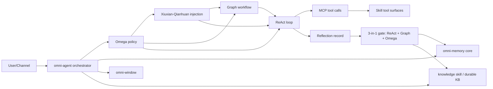

# Xiuxian-Qianhuan Unified Workflow Audit

> Status: Draft for architecture audit  
> Scope: Unified end-to-end workflow across Omega, Graph, ReAct, Xiuxian-Qianhuan injection, memory, and knowledge boundaries.

Companion paper study:

- [Xiuxian-Qianhuan Paper Optimization Notes (arXiv 2025-2026)](./xiuxian-qianhuan-paper-optimization-notes.md)
  Companion rollout sequence:
- [Xiuxian-Qianhuan Implementation Rollout Plan](./xiuxian-qianhuan-implementation-rollout.md)

## 1. Purpose

This document presents one auditable architecture view for the runtime workflow.
It consolidates prior decisions into a single contract:

- `Graph` = workflow structure
- `ReAct` = execution loop
- `Omega` = policy and governance
- `Xiuxian-Qianhuan` (修仙-千幻) = injection system interface layer

## 2. Layered Architecture

## 3. End-to-End Workflow (Single Turn)

1. Intake request and resolve `session_id`.
2. Load bounded session context from `omni-window`.
3. Omega selects:
   - route (`react` or `graph-first`)
   - injection mode (`single` / `classified` / `hybrid`)
   - role-mix profile.
4. Xiuxian-Qianhuan assembles immutable `InjectionSnapshot`.
5. Graph (if required) builds executable workflow contract.
6. ReAct executes tool loop via MCP.
7. Reflection produces `ReflectionRecord`.
8. 3-in-1 gate (ReAct+Graph+Omega) decides `retain` / `obsolete` / `promote`.
9. Memory lifecycle updates in Rust memory core.
10. Durable knowledge promotion writes to knowledge interface only when gate verdict is `promote`.

## 4. Domain Boundaries (Hard Rules)

- `omni-agent`: orchestration only.
- `omni-memory`: core short-term memory lifecycle/policy engine.
- `skill memory`: MCP facade to memory core, no policy duplication.
- `knowledge` skill: durable long-term knowledge interface.
- Xiuxian-Qianhuan: typed injection assembly only.

## 5. Contract Surface

Core contracts:

- `OmegaDecision`
- `PromptContextBlock`
- `InjectionPolicy`
- `InjectionSnapshot`
- `RoleMixProfile`
- `ReflectionRecord`
- `MemoryGateDecision`

Rule:

- Deterministic shortcuts (`graph ...`, `omega ...`) must consume the same injection contract path as regular turns.

## 6. Memory vs Knowledge Separation

- Short-term memory:
  - transient operational findings
  - frequency/utility-driven retention (no wall-clock-day TTL policy)
  - revalidate before purge
- Long-term knowledge:
  - stable reusable patterns only
  - accepted via promotion gate evidence

Promotion requires `3-in-1` gate verdict = `promote`.

## 7. Xiuxian-Qianhuan Injection Modes

- `single`: compact block for focused, low-complexity tasks.
- `classified`: category-capped block assembly (`memory_recall`, `knowledge`, `reflection`, etc.).
- `hybrid`: role-mix + classified blocks in one immutable snapshot.

Role mix is selected by Omega and auditable in events.

## 8. Observability Chain

Required events:

- `agent.injection.policy.selected`
- `agent.injection.role_mix.selected`
- `agent.injection.snapshot.created`
- `agent.injection.block.dropped`
- `agent.injection.block.truncated`
- `agent.reflection.recorded`
- `agent.memory.revalidate.decision`
- `agent.memory.purged`
- `agent.memory.promoted`
- `agent.discover.ranking.emitted`
- `agent.discover.confidence.classified`
- `agent.route.fallback.applied`

## 8.1 Data Plane Audit

- `Valkey` owns hot-path:
  - session/runtime state
  - dedup/idempotency
  - stream/event counters
  - discover hot cache
- `LanceDB` owns durable state:
  - tool/knowledge retrieval persistence
  - episodic memory durability
  - replay/analytics source
- `Arrow` owns inter-stage contract:
  - discover match rows
  - route trace rows
  - memory gate decision rows

## 9. Audit Checklist

Use this checklist before implementation:

- Layer responsibilities are non-overlapping.
- Agent does not embed memory policy logic.
- MCP facades do not duplicate core lifecycle decisions.
- Injection path is unified for regular and deterministic shortcut routes.
- Memory purge never happens without 3-in-1 gate decision.
- Knowledge promotion only happens with stable reusable evidence.
- Observability fields are sufficient for root-cause replay.
- Discover output always includes calibrated confidence and ranking reason.
- Data plane boundaries (`Valkey` hot, `LanceDB` durable, `Arrow` contract) are enforced in code.

## 10. Current Gap to Close

- Shortcut path parity:
  - ensure `graph ...` and `omega ...` route through Xiuxian-Qianhuan snapshot assembly and 3-in-1 post-run gate hooks.
