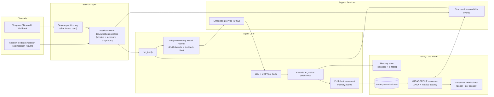
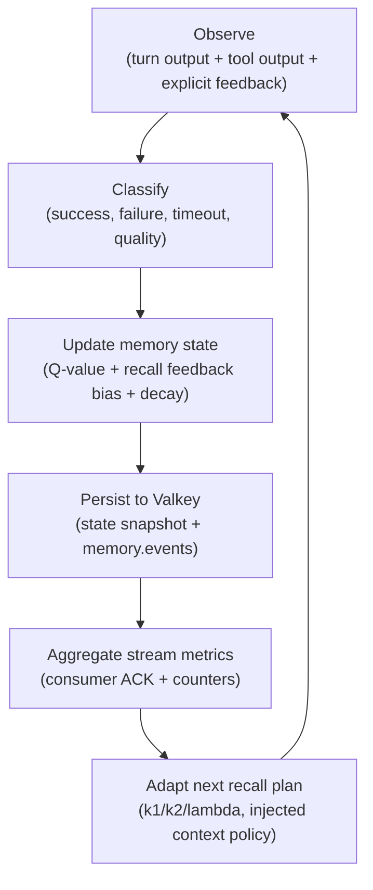
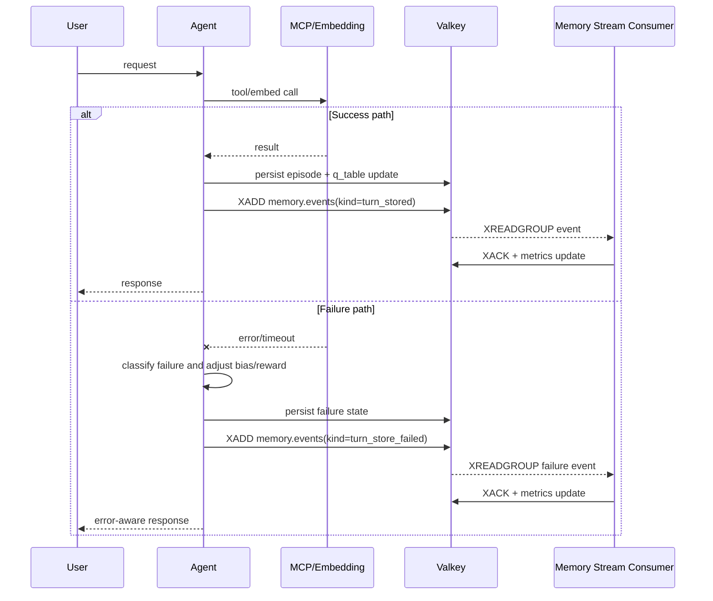

# Omni-Agent Memory Self-Evolution and Self-Repair

This document captures the current production architecture for self-evolving and self-repairing memory behavior in `omni-agent`, based on the MemRL-inspired runtime (`omni-memory`) and Valkey-backed event processing.

## Goals

- Keep memory behavior adaptive at runtime without model-weight updates.
- Make failure signals first-class inputs to future recall and planning.
- Persist learning state across process restarts and multi-instance deployments.
- Provide deterministic observability for diagnosing memory decisions.

## Modularization Standard (Persistent Memory)

For persistent-memory implementation code, enforce directory-level modularization:

- `mod.rs` is interface-only:
  - declare sub-modules
  - re-export stable contracts/types
  - keep orchestration wiring thin
- implementation logic lives in dedicated sub-modules under feature folders (for example `reflection/`, `memory/`, `persistence/`), not in one growing file.
- add new behavior by creating focused sub-module files (or nested sub-folders) and importing via module boundaries.
- keep tests in `tests/` files mapped to module responsibility; avoid inline test bodies in complex runtime modules.

Reference pattern:

```text
agent/
  reflection/
    mod.rs            # interface + re-exports only
    lifecycle.rs      # diagnose/plan/apply state machine
    turn.rs           # reflection payload + rendering
    policy_hint.rs    # next-turn routing hint derivation
```

## System Architecture



## Self-Evolution Loop



## Self-Repair Workflow



## Event and Learning Contracts

### Producer events (examples)

- `turn_stored`
- `turn_store_failed`
- `consolidation_enqueued`
- `consolidation_stored`
- `consolidation_store_failed`
- `recall_snapshot_updated`
- `recall_feedback_bias_updated`

### Consumer behavior

- Creates group with `XGROUP CREATE ... MKSTREAM` (idempotent with `BUSYGROUP` handling).
- Replays pending events first (`stream_id=0`), then consumes new events (`stream_id=>`).
- Uses `XACK` after processing and updates:
  - global metrics hash: `...:metrics:<stream>:consumer`
  - per-session metrics hash: `...:metrics:<stream>:consumer:session:<session_id>`

## Configuration Surface

### `settings.yaml` (`memory` section)

- `stream_consumer_enabled`
- `stream_name`
- `stream_consumer_group`
- `stream_consumer_name_prefix`
- `stream_consumer_batch_size`
- `stream_consumer_block_ms`

### Environment overrides

- `OMNI_AGENT_MEMORY_STREAM_CONSUMER_ENABLED`
- `OMNI_AGENT_MEMORY_STREAM_NAME`
- `OMNI_AGENT_MEMORY_STREAM_CONSUMER_GROUP`
- `OMNI_AGENT_MEMORY_STREAM_CONSUMER_NAME_PREFIX`
- `OMNI_AGENT_MEMORY_STREAM_CONSUMER_BATCH_SIZE`
- `OMNI_AGENT_MEMORY_STREAM_CONSUMER_BLOCK_MS`

## Observability

Consumer-specific observability events:

- `agent.memory.stream_consumer.started`
- `agent.memory.stream_consumer.disabled`
- `agent.memory.stream_consumer.group_ready`
- `agent.memory.stream_consumer.event_processed`
- `agent.memory.stream_consumer.read_failed`

## Verification

Use these tests to verify current behavior:

```bash
cargo test -p omni-agent --test config_settings
cargo test -p omni-agent --test observability_session_events
cargo test -p omni-agent --lib memory_stream_consumer::tests
VALKEY_URL=redis://<valkey-host>:6379/0 \
  cargo test -p omni-agent --lib \
  memory_stream_consumer::tests::memory_stream_consumer_acks_and_tracks_metrics -- --ignored
```

For release gates, aggregate black-box reports into one SLO decision:

```bash
just test-omni-agent-memory-slo-report
just test-omni-agent-memory-slo-report \
  .run/reports/omni-agent-memory-evolution.json \
  .run/reports/omni-agent-memory-benchmark.json \
  .run/reports/agent-channel-session-matrix.json \
  .run/logs/omni-agent-webhook.log \
  true
```

## Commercial SLO and Acceptance Dashboard

### SLO targets (recommended baseline)

| Area                                 | SLO target                                                | Primary signal                                                         |
| ------------------------------------ | --------------------------------------------------------- | ---------------------------------------------------------------------- |
| Session isolation correctness        | 99.99% (no cross-session recall contamination)            | Scoped recall/store checks + multi-session black-box suite             |
| Memory stream processing reliability | 99.9% event ack success                                   | `agent.memory.stream_consumer.event_processed` vs stream publish count |
| Turn stability under load            | p95 turn latency within target profile by deployment tier | Channel runtime + recall latency snapshots                             |
| Recovery behavior                    | No data-loss on restart for persisted memory state        | Startup load/save events + continuity test                             |
| Safety under backend faults          | Explicit fail-fast or explicit degraded mode only         | `memory.persistence_strict_startup` policy + startup logs              |

### Metric mapping (what to track)

| Concern                                     | Where to read                                                                                    |
| ------------------------------------------- | ------------------------------------------------------------------------------------------------ |
| Recall planning/injection/skip distribution | `agent.memory.recall.planned`, `agent.memory.recall.injected`, `agent.memory.recall.skipped`     |
| Feedback adaptation activity                | `agent.memory.recall.feedback_updated`                                                           |
| Stream consumer health                      | `agent.memory.stream_consumer.started`, `...group_ready`, `...event_processed`, `...read_failed` |
| Producer vs consumer volume                 | Valkey stream length + consumer metrics hashes (`processed_total`, `processed_kind:*`)           |
| Persistence durability                      | `agent.memory.state_load_succeeded/failed`, `agent.memory.state_save_succeeded/failed`           |
| Isolation regressions                       | Session-matrix black-box results + scope-isolation tests                                         |

### Black-box acceptance workflow

1. Start Valkey + MCP + channel runtime with production-like settings.
2. Run multi-session/multi-group concurrency suite (mixed normal turns + `/session` commands).
3. Run memory evolution suite (complex DAG scenarios, explicit failure injection).
4. Verify stream consumer metrics converge (published events ~= processed/acked events).
5. Restart runtime and re-run continuity checks (`/session memory`, recall snapshot continuity).
6. Gate release only when all SLO targets and no-cross-session invariants pass.

### Release gate checklist

- Memory persistence backend policy is explicit (`valkey` with strict startup for production).
- Stream consumer is enabled and group creation succeeds.
- No sustained growth of unacked stream events.
- No unauthorized cross-session restore/reset effects.
- Observability events are present and parseable by automation.

## Scope Boundaries

- This layer evolves memory policy and retrieval behavior, not base model weights.
- Long-term memory (`omni-memory`) and skill knowledge stores remain separate concerns.
- Session reset/resume commands affect session context; memory durability is controlled by memory persistence and feedback policies.
